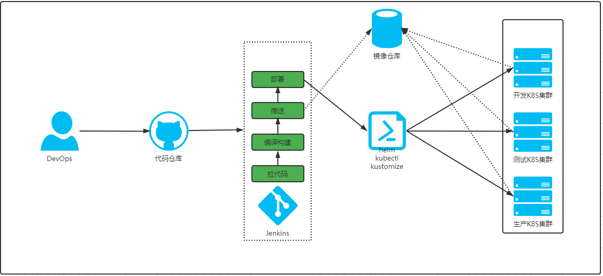
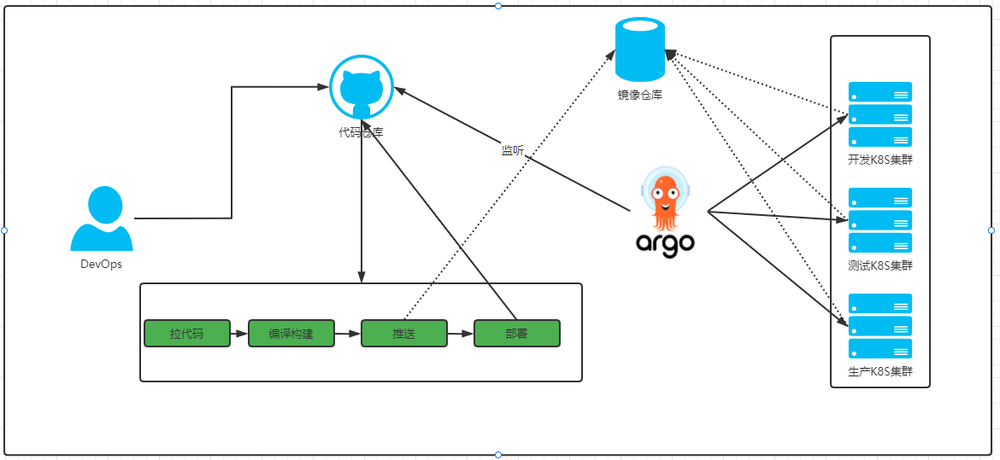

## What are the common CICD processes?

Nowadays, very few companies do manual version updates and restart applications, even the smallest companies have a CICD process.

(1) host mode: this process is mainly deployed on bare metal applications

This model is mainly done through Jenkins for continuous integration and then through Ansible automation tools for continuous delivery.

(2) Container mode: This process is mainly to deploy the application to Kubernetes

(3) Using GitOps

The above CI processes are the most basic ones, but you can add your own processes to them, such as automated testing, code quality testing, product security testing, and so on. This column focuses on the third type: using Jenkins+GitOps to achieve continuous delivery.
