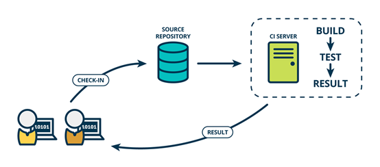

### CI

The English name for CI is Continuous Integration, which translates to Continuous Integration.

In CI, developers will frequently commit code to the backbone, and these new commits will need to be compiled and validated by an automated test flow before they are finally merged into the backbone.
Continuous Integration (CI) is the process of automatically detecting, pulling, building, and (in most cases) unit testing source code changes as they occur. The goal of continuous integration is to quickly ensure that new changes submitted by developers are good and suitable for further use in the codebase.The process implementation and theoretical practice of CI allows us to determine if the new code and the original code are properly integrated together.
