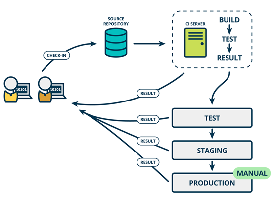

### CD

CD can correspond to several English names, Continuous Delivery and Continuous Deployment, which are described below.

#### Continuous Delivery

After automating the build and unit and integration testing process in CI, Continuous Delivery automatically releases the verified code to the repository. To achieve an efficient continuous delivery process, it is important to ensure that CI is built into the development pipeline. The goal of Continuous Delivery is to have a code repository that is ready to be deployed to the production environment.

In Continuous Delivery, each phase (from the merging of code changes to the delivery of production-ready builds) involves test automation and code release automation. At the end of the process, the operations team can quickly and easily deploy the application to the production environment or release it to end-users.

#### Continuous Deployment

The final phase for a mature CI/CD pipeline (Pipeline) is Continuous Deployment. As an extension of Continuous Delivery - the automatic release of production-ready builds to code repositories - Continuous Deployment automates the release of applications to production environments.

Continuous deployment means that all changes are automatically deployed to the production environment. Continuous delivery means that all changes can be deployed to the production environment, but can be chosen not to be deployed for business reasons. If you want to implement continuous deployment, you must first implement continuous delivery.
Continuous delivery does not mean that every change to the software has to be deployed to the product environment as soon as possible; it means that any code change can be implemented for deployment at any time.
Continuous delivery represents a capability, while continuous deployment represents a way. Continuous deployment is the highest stage of continuous delivery.
