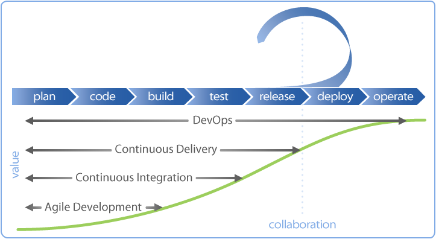

## Relationship between CICD and DevOps

CICD is a method of software engineering practice, while DevOps is a culture. CICD is only one part of the DevOps culture, but from the current practice in China, CICD is the most important part.

