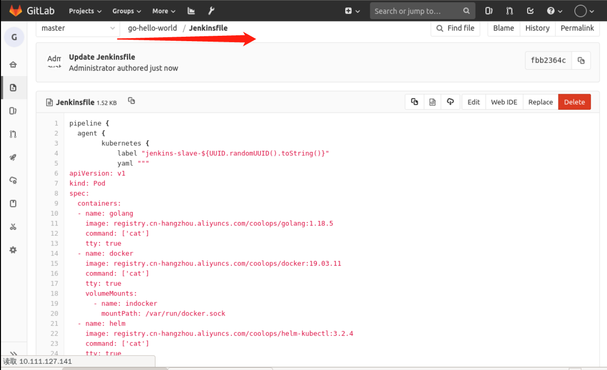
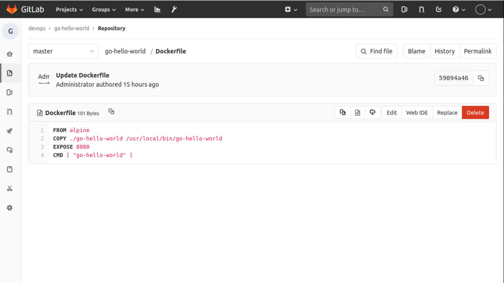
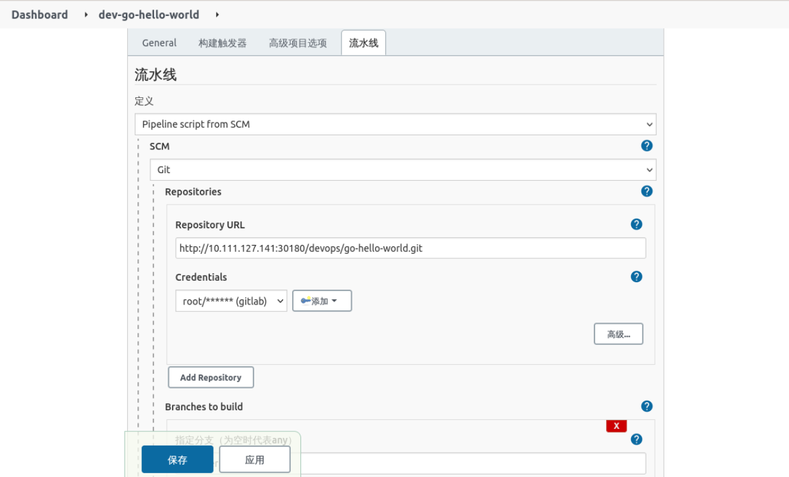

## Development Pipeline

Before we develop, let's organize the process clearly: the

- Pull the code
- Compile the code
- Build the image and push
- Deploy the application

Thus, the template for our entire Pipeline can be defined as follows:

```groovy
pipeline {
  agent any
  stages {
    stage('Get Code') {
        steps {
            print('Get Code')
        }
    }
    stage('Build Code') {
        steps {
            print('Build Code')
        }
    }
    stage('Build And Push Image') {
        steps {
            print('Build And Push Image')
        }
    }
    stage('Deploy') {
        steps {
            print('Deploy Application')
        }
    }
  }
}
```

In the previous section we have made the Helm Chart for the `go-hello-world` project, but the dynamic Jenkins Slave we configured before does not have the Helm command, so if you want to use the configured Pod template, you need to recreate the image and integrate the Helm command into it.

But instead of going through such a hassle here, we define the template directly in the Pipeline as follows:

```groovy
pipeline {
  agent {
        kubernetes {
            label "jenkins-slave-${UUUID.randomUUUID().toString()}"
            yaml """
apiVersion: v1
kind: Pod
spec.
  containers.
  - name: golang
    image: registry.cn-hangzhou.aliyuncs.com/coolops/golang:1.18.5
    command: ['cat']
    tty: true
  - name: docker
    image: registry.cn-hangzhou.aliyuncs.com/coolops/docker:19.03.11
    command: ['cat']
    tty: true
    volumeMounts.
      - name: indocker
        mountPath: /var/run/docker.sock
  - name: helm
    image: registry.cn-hangzhou.aliyuncs.com/coolops/helm-kubectl:3.2.4
    command: ['cat']
    tty: true
    volumeMounts.
      - name: kubeconfig
        mountPath: /root/.kube
  volumes.
    - name: indocker
      hostPath.
        path: "/var/run/docker.sock"
    - name: kubeconfig
      hostPath.
        path: "/home/shiyanlou/.kube"
"""
        }
    }

  stages {
    stage('Get Code') {
        steps {
            print('Get Code')
        }
    }
    stage('Build Code') {
        steps {
            container('golang'){
                script{
                    print('Build Code')
                }
            }
        }
    }
    stage('Build And Push Image') {
        steps {
            container('docker'){
                script{
                    print('Build And Push Image')
                }
            }
        }
    }
    stage('Deploy'){
        steps{
            container('helm'){
                script{
                    print('Deploy Application')
                }
            }
        }
    }
  }
}
```

Caution:

- Which container we want to use needs to be specified with `container` in stage.steps.
- The script for the steps to be executed is placed under `script`

This allows us to customize the template as we see fit, without interfering with other projects and without having to configure it on Jenkins.

Then create a `Jenkinsfile` in the `go-hello-world` project and enter the above, as follows:



Create a `Dockerfile` file and enter the following:

```dockerfile
FROM alpine
COPY . /go-hello-world /usr/local/bin/go-hello-world
EXPOSE 8080
CMD [ "go-hello-world" ]
```



Create a `dev-go-hello-world` project on Jenkins and configure the `go-hello-world` repository information at `Pipeline` as follows



The information after that is fine by default. However, if the Pipeline file is not named `Jenkinsfile` in the repository, you need to change the **script path** in the pipeline configuration, as follows


Now, run the pipeline and see if it works, the following indicates that it is fine:


