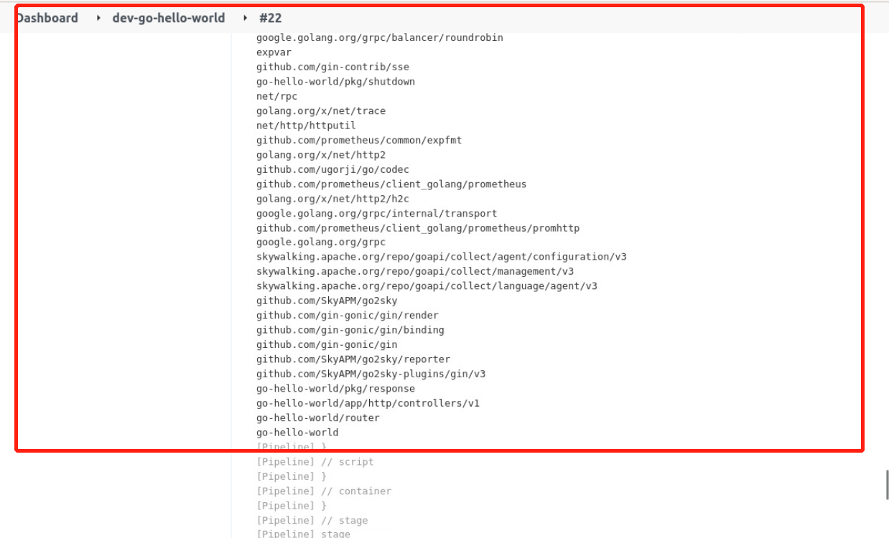

### Build the application

Building the application is also called packaging the application. Since our `go-hello-world` is a Golang project and the logic is relatively simple, you can just use `go build main.go` to finish the build.

So, our code is as follows:

```groovy
pipeline {
  agent {
        kubernetes {
            label "jenkins-slave-${UUUID.randomUUUID().toString()}"
            yaml """
apiVersion: v1
kind: Pod
spec.
  containers.
  - name: golang
    image: registry.cn-hangzhou.aliyuncs.com/coolops/golang:1.18.5
    command: ['cat']
    tty: true
  - name: docker
    image: registry.cn-hangzhou.aliyuncs.com/coolops/docker:19.03.11
    command: ['cat']
    tty: true
    volumeMounts.
      - name: indocker
        mountPath: /var/run/docker.sock
  - name: helm
    image: registry.cn-hangzhou.aliyuncs.com/coolops/helm-kubectl:3.2.4
    command: ['cat']
    tty: true
    volumeMounts.
      - name: kubeconfig
        mountPath: /root/.kube
  volumes.
    - name: indocker
      hostPath.
        path: "/var/run/docker.sock"
    - name: kubeconfig
      hostPath.
        path: "/home/shiyanlou/.kube"
"""
        }
    }

  stages {
    stage('Get Code') {
        steps {
            checkout(scm)
        }
    }
    stage('Build Code') {
        steps {
            container('golang'){
                script{
                    sh '''
                        export GOPROXY=https://goproxy.cn
                        export GOOS=linux
                        export GOARCH=386
                        go mod tidy
                        go build -v -o . /go-hello-world
                    '''
                }
            }
        }
    }
    stage('Build And Push Image') {
        steps {
            container('docker'){
                script{
                    print('Build And Push Image')
                }
            }
        }
    }
    stage('Deploy'){
        steps{
            container('helm'){
                script{
                    print('Deploy Application')
                }
            }
        }
    }
  }
}
```

Among them:

- `export GOPROXY=https://goproxy.cn` Use a domestic proxy to speed up pulling dependencies
- `export GOOS=linux` Specify the platform
- `export GOARCH=386` Specify the processor architecture

Overwrite the Jenkinsfile in `go-hello-world` with the above, then click build on Jenkins and see if the build succeeds and the output log indicates that the code is working: `export GOARCH=386`:


