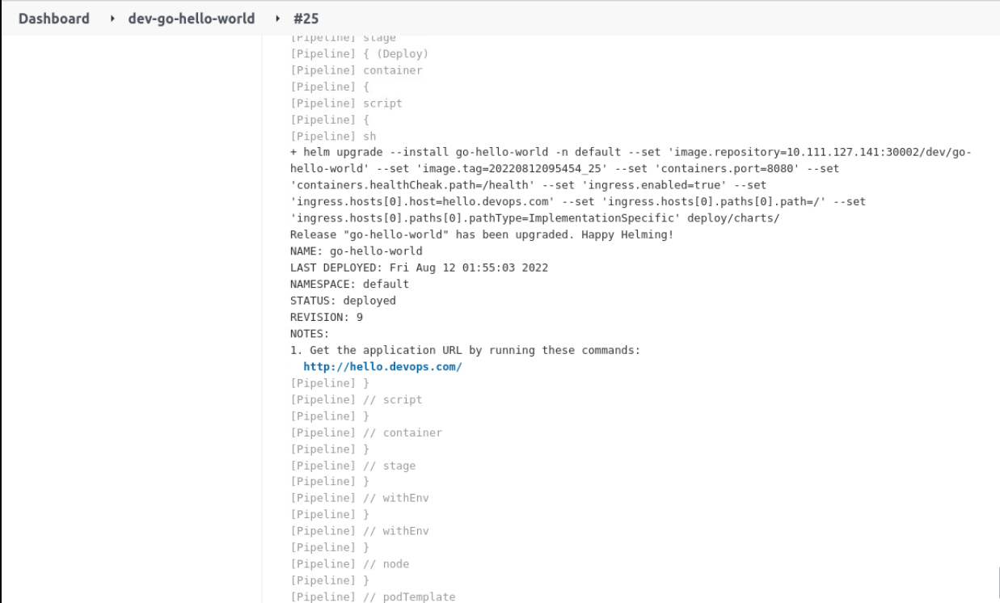

### Deploy the application

We have prepared `Helm Chart` in the code repository under the `deploy/charts` directory, so here we can deploy it directly using the `helm` command as follows:

```groovy
@Library('sharelibrary')

def tools = new org.devops.tools()

pipeline {
  agent {
        kubernetes {
            label "jenkins-slave-${UUUID.randomUUUID().toString()}"
            yaml """
apiVersion: v1
kind: Pod
spec.
  containers.
  - name: golang
    image: registry.cn-hangzhou.aliyuncs.com/coolops/golang:1.18.5
    command: ['cat']
    tty: true
  - name: docker
    image: registry.cn-hangzhou.aliyuncs.com/coolops/docker:19.03.11
    command: ['cat']
    tty: true
    volumeMounts.
      - name: indocker
        mountPath: /var/run/docker.sock
  - name: helm
    image: registry.cn-hangzhou.aliyuncs.com/coolops/helm-kubectl:3.2.4
    command: ['cat']
    tty: true
    volumeMounts.
      - name: kubeconfig
        mountPath: /root/.kube
  volumes.
    - name: indocker
      hostPath.
        path: "/var/run/docker.sock"
    - name: kubeconfig
      hostPath.
        path: "/home/shiyanlou/.kube"
"""
        }
    }

  environment{
    IMAGE_REPO = "10.111.127.141:30002/dev/go-hello-world"
    IMAGE_TAG = ""
  }

  stages {
    stage('Get Code') {
        steps {
            checkout(scm)
        }
    }
    stage('Build Code') {
        steps {
            container('golang'){
                script{
                    sh '''
                        export GOPROXY=https://goproxy.cn
                        export GOOS=linux
                        export GOARCH=386
                        go mod tidy
                        go build -v -o . /go-hello-world
                    '''
                }
            }
        }
    }
    stage('Build And Push Image') {
        steps {
            container('docker'){
                script{

                    IMAGE_TAG = tools.createImageTag()
                    sh """
                        docker login 10.111.127.141:30002 -u admin -p Harbor12345
                        docker build -t ${IMAGE_REPO}:${IMAGE_TAG} -f Dockerfile .
                        docker push ${IMAGE_REPO}:${IMAGE_TAG}
                    """
                }
            }
        }
    }
    stage('Deploy'){
        steps{
            container('helm'){
                script{
                    sh """
                        helm upgrade --install go-hello-world -n default \
                        --set image.repository=${IMAGE_REPO} \
                        --set image.tag=${IMAGE_TAG} \
                        --set containers.port=8080 \
                        --set containers.healthCheak.path=/health \
                        --set ingress.enabled=true \
                        --set ingress.hosts[0].host=hello.devops.com \
                        --set ingress.hosts[0].paths[0].path=/ \
                        --set ingress.hosts[0].paths[0].pathType=ImplementationSpecific deploy/charts/
                    """
                }
            }
        }
    }
  }
}
```

Since we need to use images in both the `Build And Push Image` and `Deploy` phases, we set `IMAGE_REPO` and `IMAGE_TAG` to global variables and add the following code at the `stages` level of the Pipeline:

```groovy
environment{
    IMAGE_REPO = "10.111.127.141:30002/dev/go-hello-world"
    IMAGE_TAG = ""
  }
```

This allows both variables to be used at all steps.

Finally, we use `helm upgrage --install` to deploy the app and update it if it exists in Kubernetes, or install it if it doesn't.

We replace `Jenkinsfile` in `go-hello-world` with the above, and then execute the pipeline, with the following log output indicating that the pipeline ran successfully:



Then we observe in Kubernetes that the application is deployed properly as follows:


