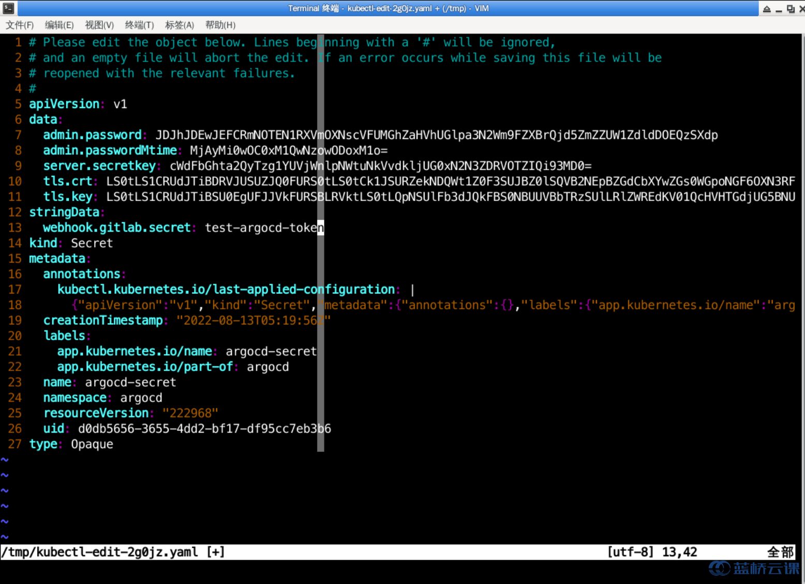
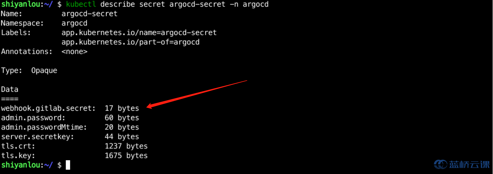
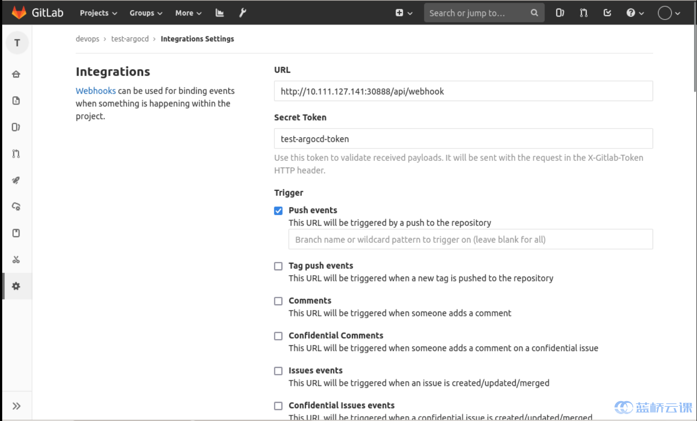
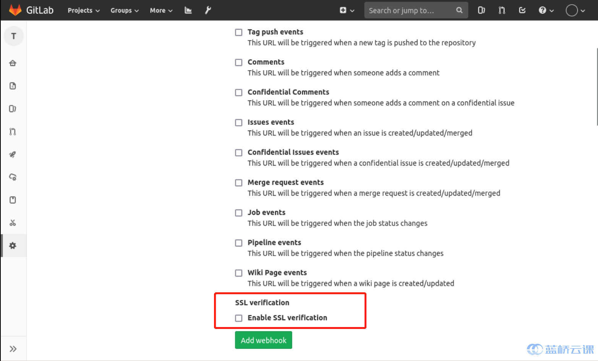

### Configure Webhook to speed up Argocd configuration updates

Of course, we're actually configuring automatic synchronization, which means that after you update your Gitlab image, Argocd will automatically pull the configuration and update it, but not in real time.

To eliminate polling latency, you can configure the API server to receive Webhook events. argo CD supports Git Webhook notifications from GitHub, GitLab, Bitbucket, Bitbucket Server, and Gogs, and we're focusing on configuring Gitlab here.

#### modifies argocd-secret to add a Gitlab webhook token

Use `kubectl edit secret argocd-secret -n argocd` to open the configuration file and add the following code:

```yaml
stringData.
  webhook.gitlab.secret: test-argocd-token
```



Click save and save it to argocd-secret, and use `kubectl describe secret argocd-secret -n argocd` to see it as follows:



Then on Gitlab, select `settings` -> `integrations` to configure the webhook, as follows



Since the cluster internal certificate is an invalid certificate, remove the Enabled SSL as follows:



Then you can test the update, and you can see that Argocd will start performing the update as soon as you commit it in Gitlab.
