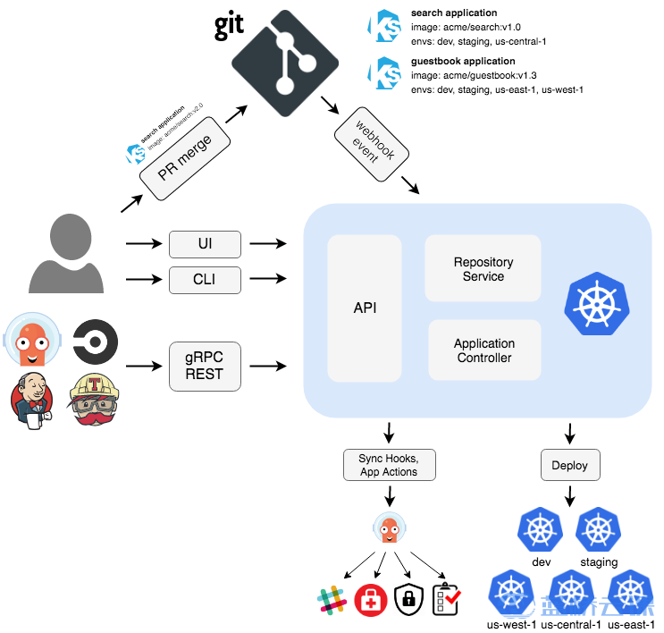

## What is Argocd

Argocd is based on the GitOps concept. It's a Git-centric implementation that monitors the state of Git at all times, and if the desired state doesn't match the actual state, it synchronizes the desired state so that the desired state matches the actual state.

The core concepts are:

- Application: defines the list of application configurations, defines the source of the application configuration and the destination to which it is to be deployed
- Target state: the desired state
- Live state: the actual state
- Sync status: Sync state
- Sync: Sync operation, synchronizes the configuration in Git
- Refresh: Refresh, which compares the actual state to the desired state
- Health: Application health status, a factual check of the application's condition
- Project: Grouping applications together
