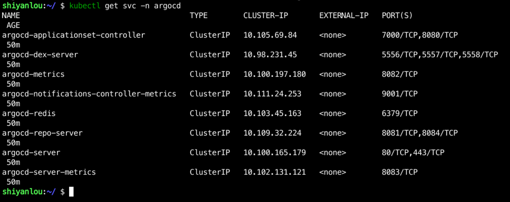
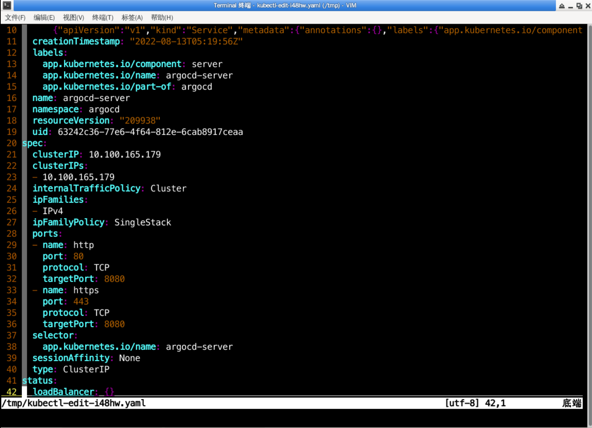
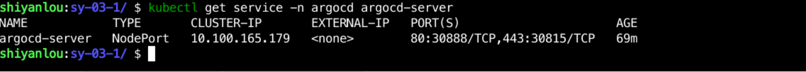
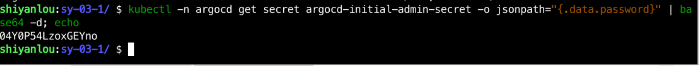
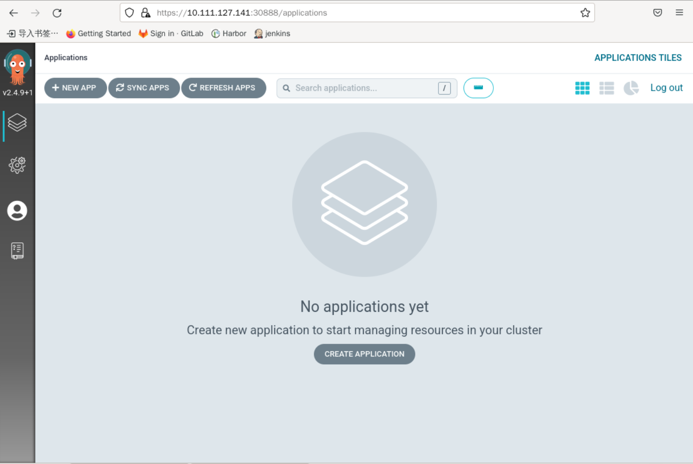

## Access Argocd

After deployment, you can use `argocd-server` to access the UI interface and use `kubectl get serivce -n argocd` to check the service status as follows



However, the services in the above diagram are of the ClusterIP type, which cannot be accessed directly from outside, and can be accessed in two ways:

- Change the Service type to NodePort
- Add an Ingress

For convenience, here we use NodePort directly for access.

Access the Service edit interface via `kubectl edit service -n argocd argocd-server`, as follows:



Then change the Type type to `NodePort`, save and exit.

Use `kubectl get service -n argocd argocd-server` to see the NodePort, as follows:



The diagram shows a NodePort of `30888`, which we can then access using `http://10.111.127.141:30888`, as follows:


The default username is `admin` and the password is stored in `argocd-initial-admin-secret`, which can be viewed with the following command:

```bash
kubectl -n argocd get secret argocd-initial-admin-secret -o jsonpath="{.data.password}" | base64 -d; echo
```

as follows:



Then, after logging in with your username and password, you will enter the following screen:


