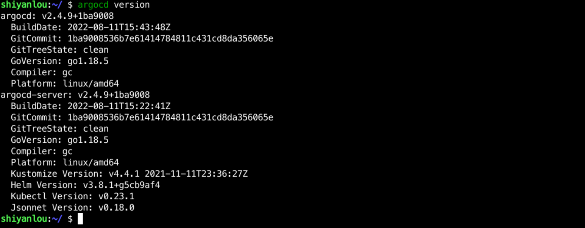
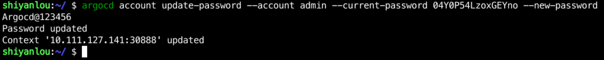

## Change password

The initial password is complex and not suitable for remembering, so it may be necessary to change it.

There is no place to change the password in the UI interface, so if you want to change the password, you can only do it through the client.

You can choose the appropriate client from the `https://github.com/argoproj/argo-cd/releases` page, and if the network is better, you can install it directly using the following command:

```bash
wget https://github.com/argoproj/argo-cd/releases/download/v2.4.9/argocd-linux-amd64
chmod +x argocd-linux-amd64
sudo mv argocd-linux-amd64 /usr/local/bin/argocd
```

If network conditions are not good, you can use the following command for installation:

```bash
wget https://gitee.com/coolops/go-hello-world/releases/download/v2.4.9/argocd-linux-amd64.zip
unzip argocd-linux-amd64.zip
chmod +x argocd-linux-amd64
sudo mv argocd-linux-amd64 /usr/local/bin/argocd
```

After the installation is complete use `argocd version` to view the information as follows:


We found that the query for Argocd-Server failed because we need to log in, so we used `argocd login 10.111.127.141:30888` to log in, as follows:


Once logged in successfully, you can query the information using `argocd version` as follows



Now, we can use `argocd account update-password --account admin --current-password xxxx --new-password xxxx` to change the password, for example, I change it to `Argocd@123456` here, the full command is as follows

```bash
argocd account update-password --account admin --current-password 04Y0P54LzoxGEYno --new-password Argocd@123456
```

The output of the successful modification is as follows:



Then the UI interface can be re-logged in with the new password.
