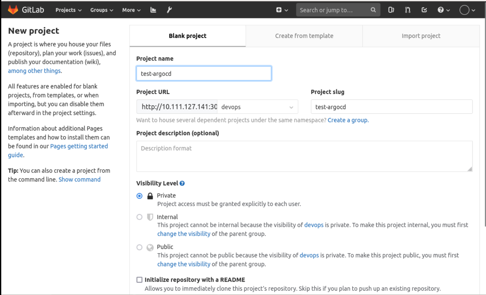
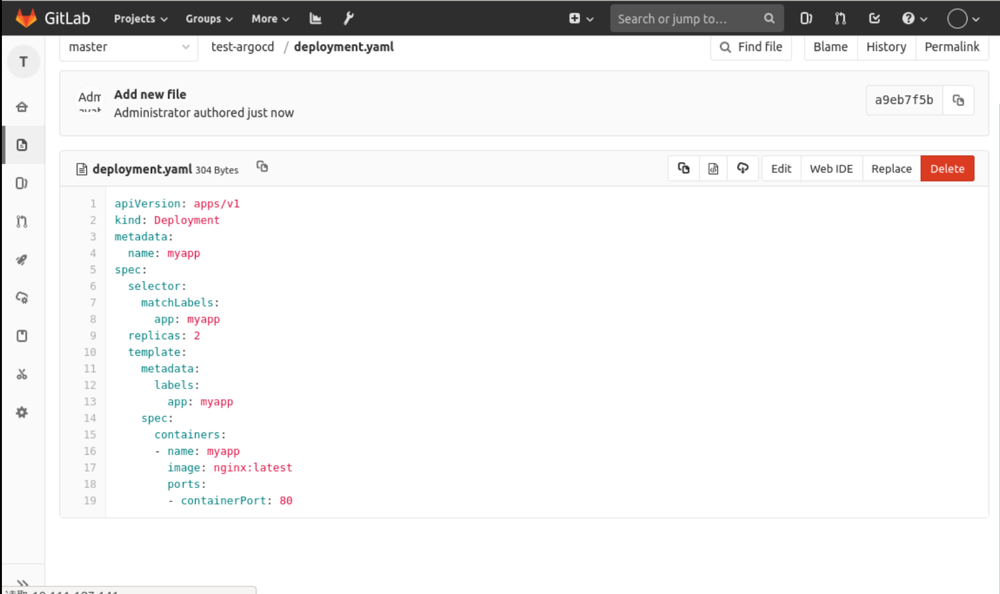
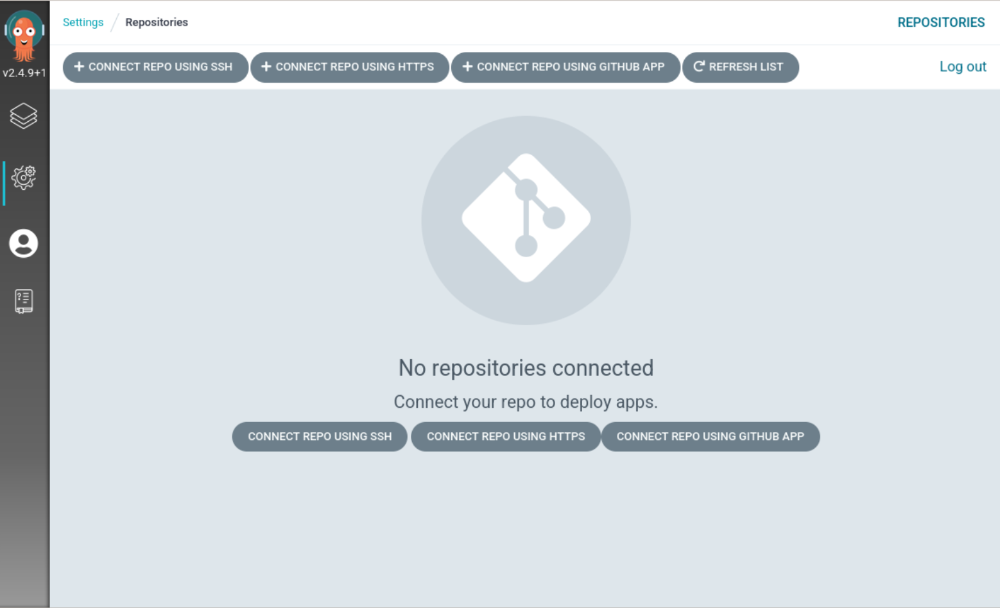

### Application deployment

Create a `test-argocd` project on Gitlab, as follows:



Then add a new `deployment.yaml` file to the `test-argocd` repository and write the following:

```yaml
apiVersion: apps/v1
kind: Deployment
metadata.
  name: myapp
spec.
  selector.
    matchLabels.
      app: myapp
  replicas: 2
  template.
    metadata.
      labels.
        app: myapp
    spec.
      containers.
        - name: myapp
          image: nginx:latest
          ports.
            - containerPort: 80
```



Add another `service.yaml` file and enter the following:

```yaml
apiVersion: v1
kind: Service
metadata.
  name: myapp
spec.
  selector.
    app: myapp
  ports.
    - port: 80
      protocol: TCP
      targetPort: 80
```


Finally, we create an argo-application.yaml file in `/home/shiyanlou/Code/devops/sy-03-1` and enter the following:

```yaml
apiVersion: argoproj.io/v1alpha1
kind: Application
metadata.
  name: myapp
  namespace: argocd
spec.
  project: default

  source.
    repoURL: http://10.111.127.141:30180/devops/test-argocd.git
    targetRevision: HEAD
    path: .
  destination.
    server: https://kubernetes.default.svc
    namespace: default

  syncPolicy.
    syncOptions.
      - CreateNamespace=true

    automated.
      selfHeal: true
      prune: true
```

At this point, if you use `kubectl apply -f argo-application.yaml` to create the repository directly, you will get an error because our Git repository is private and you need to be logged in to authenticate.

In the UI, click `Settings` and select `Repositories` to get to the following screen:



Then click `CONNECT REPO USING HTTPS` and enter the repository information as follows:


Then click `CONNECT` above to create, as follows to indicate a successful connection:


Now, let's execute `kubectl apply -f argo-application.yaml` again to create the application, and after creating it, you can see the application in the UI interface as follows:


Click inside to see more detailed information, as follows:


