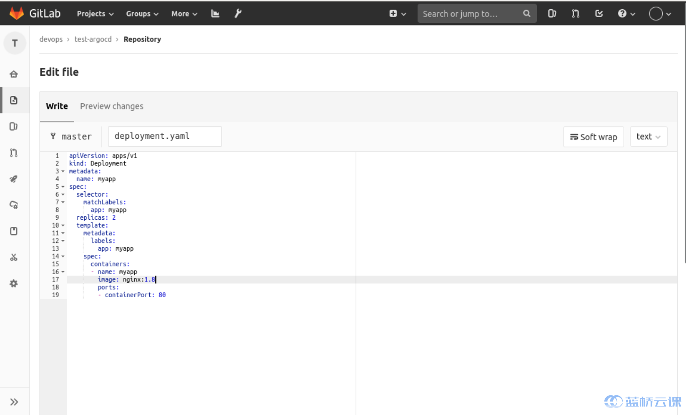
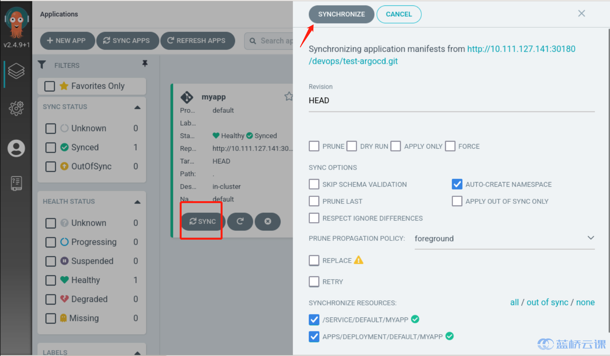
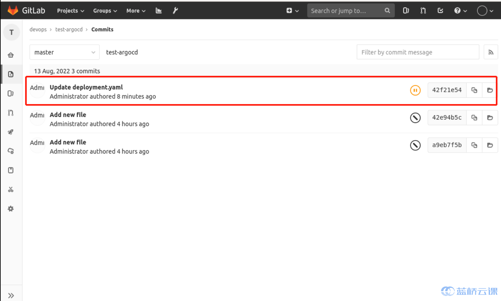
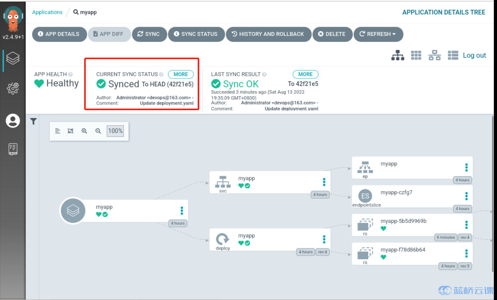

### Application Updates

Now, to update the application, instead of changing the image on Argocd, you only need to change the image address of `deployment.yaml` in the `test-argocd` repository, as follows: we update the image from `nginx:latest` to `nginx:1.8`:

Then click `sync` on Argocd as follows:

This will update the application to the latest image.

We can check to see if the commit on Gitlab matches the commit synced on argocd, as follows:

