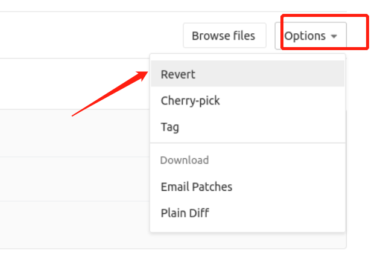
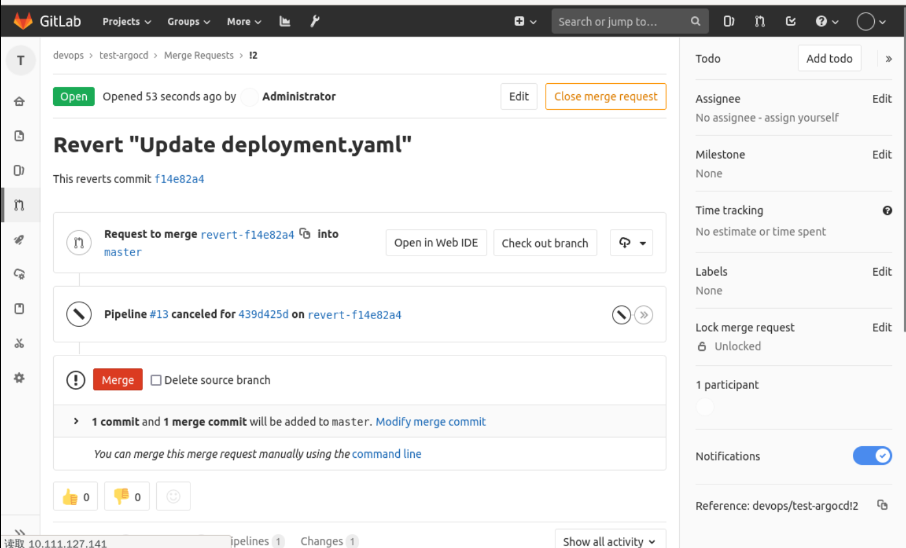
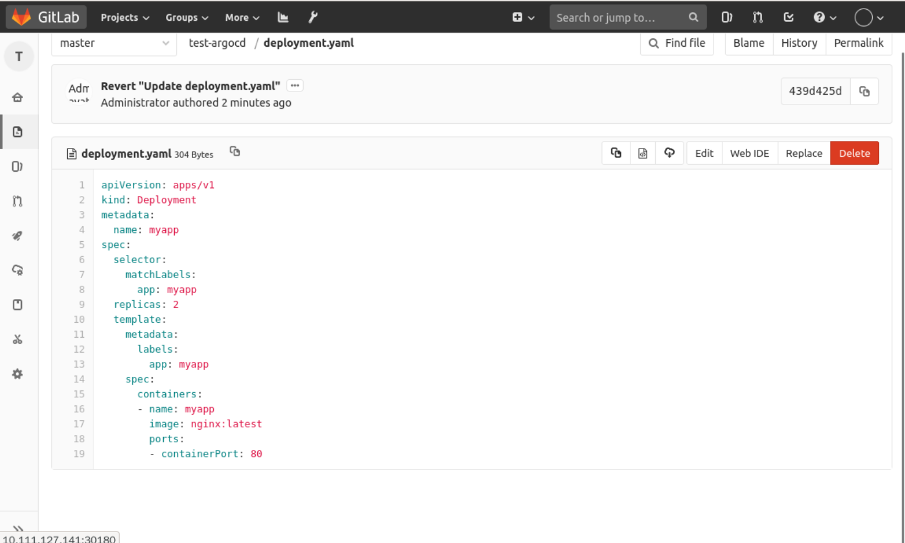

### Application rollback

The rollback is also based on Git, and we can look at the Git History as follows:

Then you can find the last commit we committed and click on it:

Find `options` and select `revert`, which will create a new Merage Request, as follows:

Clicking submit will take you to the `merge` page, as follows:

Then click `merge` to roll back the image, as follows:

Finally, just go to Argocd and click sync.
