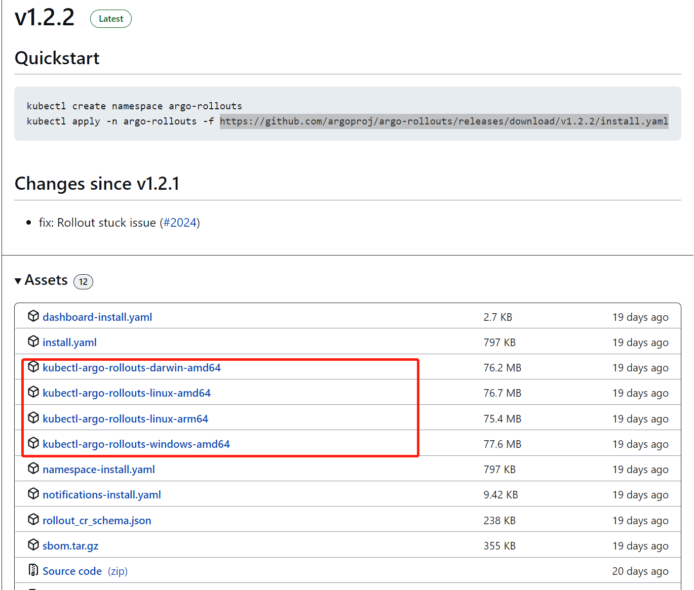
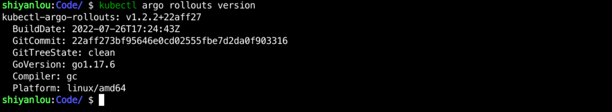

### Installing Aro rollouts

Argo rollouts is divided into a server-side and a client-side installation, where the server side is a series of custom CRDs and Controllers, and the client side is a kubectl plugin that can be used to view and manage the Argo rollouts application.

First create the `argo-rollouts` namespace with the following command:

```bash
kubectl create namespace argo-rollouts
```

Install directly using the following command:

```bash
kubectl apply -n argo-rollouts -f https://github.com/argoproj/argo-rollouts/releases/download/v1.2.2/install.yaml
```

After the installation is complete, use `kubectl get pod -n argo-rollouts` to see how the pod is starting up, as follows:


After the Controller installation is complete, let's install the kubectl plugin.

Select the corresponding version directly from `https://github.com/argoproj/argo-rollouts/releases`, for example, I have `v1.2.2` here, as follows:



Then select the corresponding version to download as follows:

```bash
curl -LO https://github.com/argoproj/argo-rollouts/releases/download/v1.2.2/kubectl-argo-rollouts-linux-amd64
chmod +x . /kubectl-argo-rollouts-linux-amd64
sudo mv . /kubectl-argo-rollouts-linux-amd64 /usr/local/bin/kubectl-argo-rollouts
```

Then use `kubectl argo rollouts version` to see if it succeeds, as follows:



This completes the installation steps.
