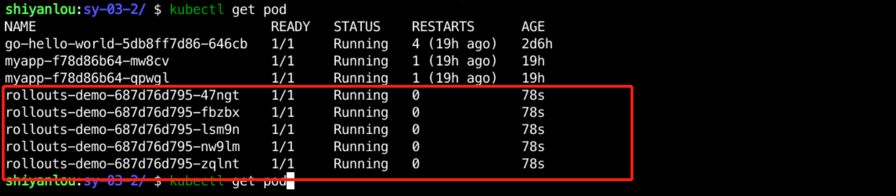
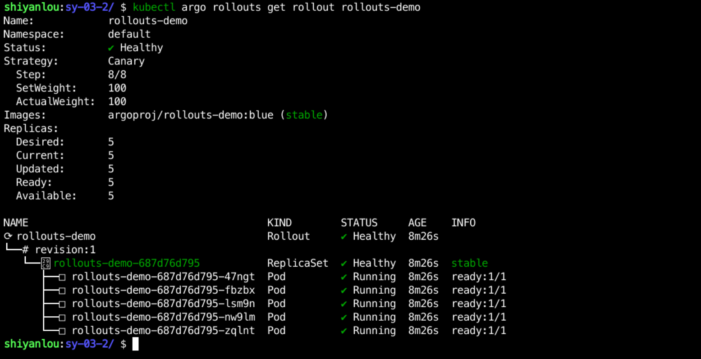
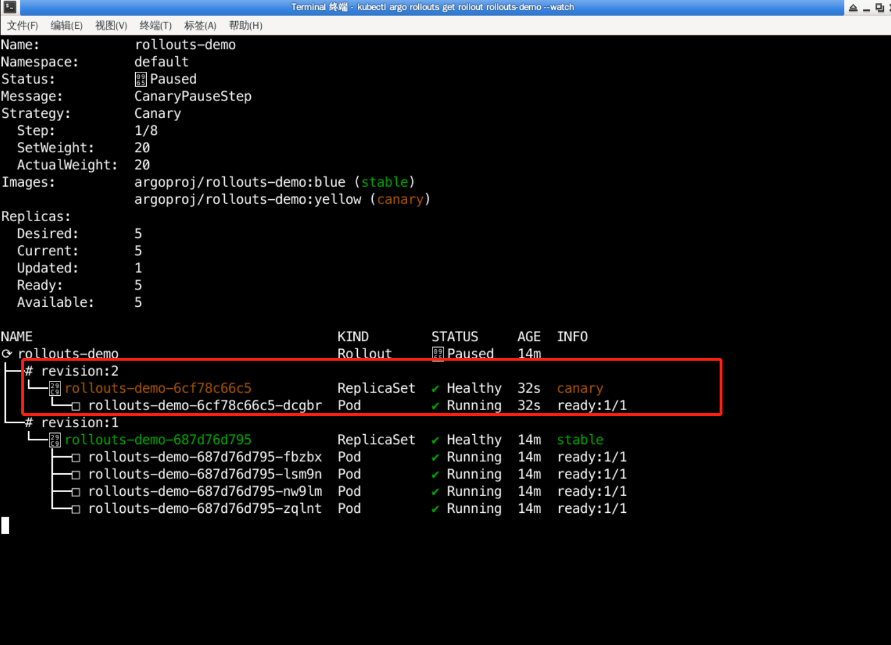
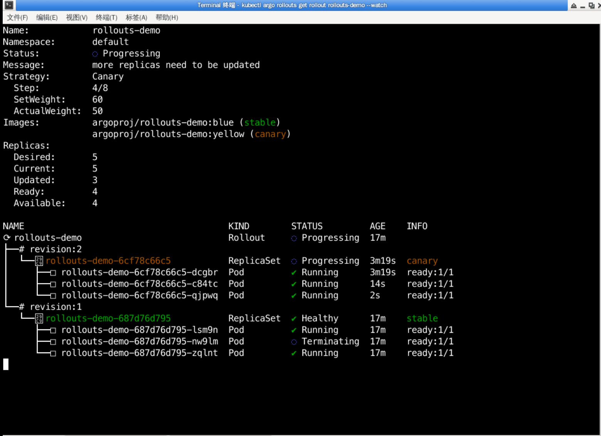
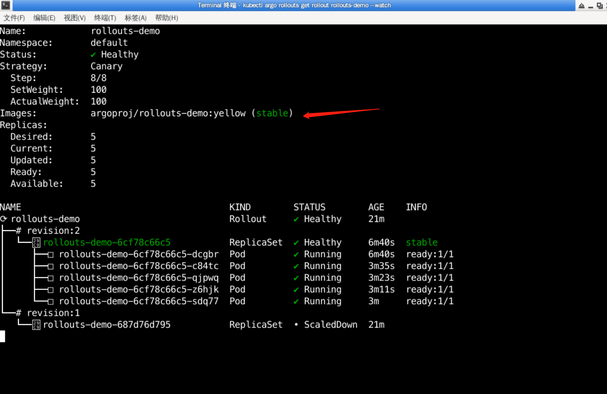
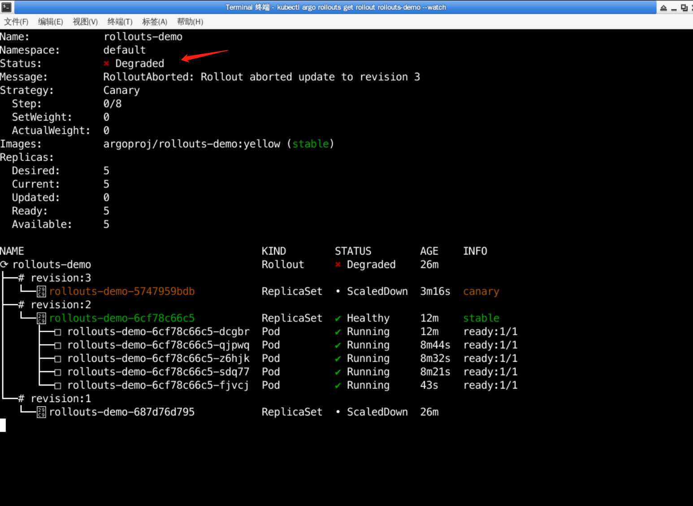
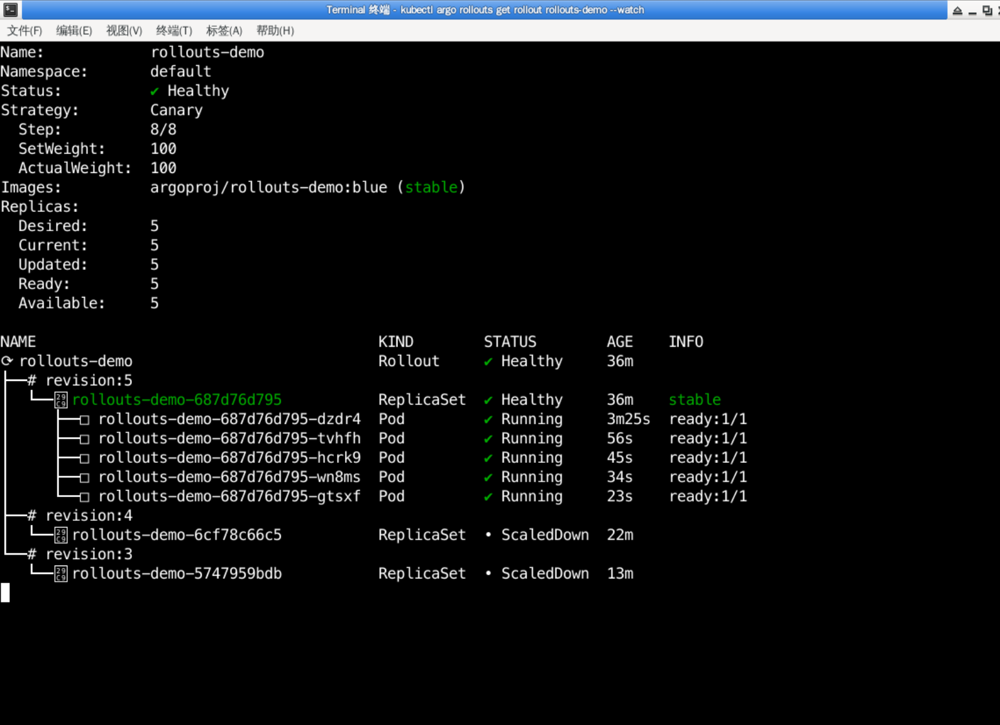

### Replica Shifting

#### Deploy the application

Create a `rollout.yaml` file under `/home/shiyanlou/Code/devops/sy-03-2` and write the following:

```yaml
apiVersion: argoproj.io/v1alpha1
kind: Rollout
metadata.
  name: rollouts-demo
spec.
  replicas: 5
  strategy.
    canary.
      steps.
        - setWeight: 20
        - pause: {}
        - setWeight: 40
        - pause: { duration: 10 }
        - setWeight: 60
        - pause: { duration: 10 }
        - setWeight: 80
        - pause: { duration: 10 }
  revisionHistoryLimit: 2
  selector.
    matchLabels.
      app: rollouts-demo
  template.
    metadata.
      labels.
        app: rollouts-demo
    spec.
      containers.
        - name: rollouts-demo
          image: argoproj/rollouts-demo:blue
          ports.
            - name: http
              containerPort: 8080
              protocol: TCP
          resources.
            requests.
              memory: 32Mi
              cpu: 5m
```

You can see that it is the same as Deployment except for `apiVersion`, `kind` and `strategy`.
The strategy field defines the release strategy, where:

- setWeight: sets the weight of the traffic
- pause: pause, if there is no duration: 10, it means you need to update it manually, if you do, it means how long you will wait to update it automatically.

Then create a `service.yaml` file in the directory and write the following content:

```yaml
apiVersion: v1
kind: Service
metadata.
  name: rollouts-demo
spec.
  ports.
    - port: 80
      targetPort: http
      protocol: TCP
      name: http
  selector.
    app: rollouts-demo
```

Then use `kubectl apply -f rollout.yaml` and `kubectk apply -f service.yaml` to create the application, which will create 5 pods of `rollout-demo` under the `default` namespace after execution, as follows:



When the Pods are `Running` use `kubectl argo rollouts get rollout rollouts-demo` to see the status of the rollouts application:



You can also add a --watch to the command to monitor the service status in real time, the full command is `kubectl argo rollouts get rollout rollouts-demo --watch`.

#### Update the application

Open a new terminal and type `kubectl argo rollouts get rollout rollouts-demo --watch` to listen to the service status.

In another terminal, type `kubectl argo rollouts set image rollouts-demo rollouts-demo=argoproj/rollouts-demo:yellow` to update the application image.

In the listening terminal you can see the following message:



There is an additional revision:2, and the revision is marked as canary, and the status is Status: Paused, and canary access traffic is 20%.

The deployment is in `Paused` because we have defined in rollout.yaml that the release will be paused after the first version is released, and that we need to manually access the next updates.

argo rollouts provides promote for subsequent updates with the following command:

```bash
kubectl argo rollouts promote rollouts-demo
```

After execution, you can see in the listening terminal that canary applications are constantly being deployed, as follows:



When all canary versions are updated, it will change from `canary` version to `stable` version, as follows



#### terminates the update

What do I need to do if there is a problem with the latest application during the update process and I need to terminate the update?

We start by publishing a new version of the application using the following command, as follows:

```bash
kubectl argo rollouts set image rollouts-demo rollouts-demo=argoproj/rollouts-demo:red
```

See in the listening terminal that the application has been partially updated, as follows:


If you do not want to publish at this point, you can use the following command to terminate the publication:

```bash
kubectl argo rollouts abort rollouts-demo
```

After the command has been executed, you can see in the listening terminal that the application has been terminated and returned to its original state, as follows:



But the status is not `Healthy`, but `Degraded`. If you want to change it to `Healthy`, you need to execute the image update command, as follows:

```bash
kubectl argo rollouts set image rollouts-demo rollouts-demo=argoproj/rollouts-demo:yellow
```

#### Rollback application

Sometimes there are bugs that are not found after the application has gone live, so what if you want to roll back? argo rollouts has an undo command that allows you to roll back.

For example, if we want to rollback to the first version, we would execute the following command:

```bash
kubectl-argo-rollouts undo rollouts-demo --to-revision=1
```

Then you can see in the listening terminal that the application is being rolled back, as follows:


The final rollback is then completed with the following command:

```bash
kubectl argo rollouts promote rollouts-demo
```

The final application image changes from `yellow` to `blue`, as follows:



After the test is complete, delete the application with the following command:

```bash
kubectl delete -f rollout.yaml
kubectl delete -f service.yaml
```
