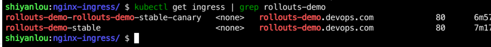
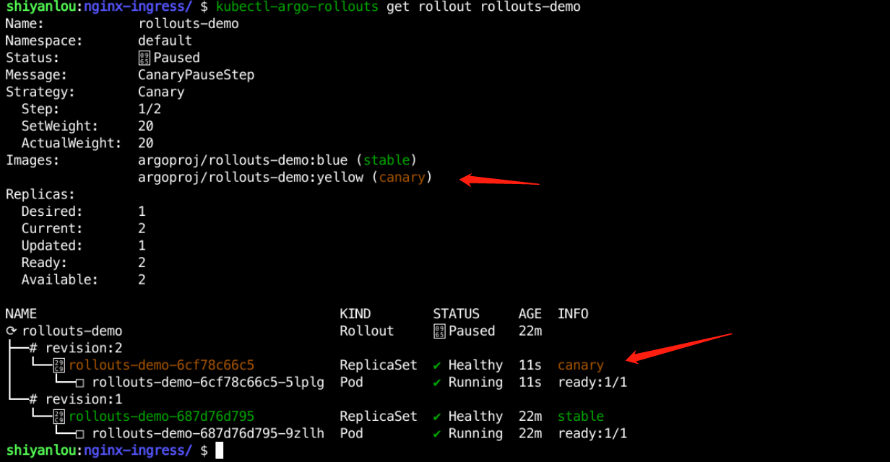
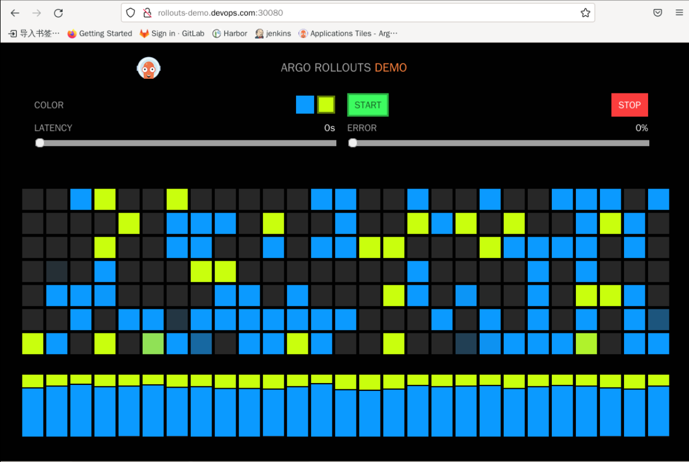

### Traffic Access (Traffic Shifting)

Above we did not access external traffic, we just used it internally to demonstrate the canary deployment process, below we access external traffic for testing.

Argo-Rollout mainly integrates two traffic control methods, Ingress and ServiceMesh.

Currently, Ingress supports ALB and NGINX ingress, here I use NGINX ingress.

#### Deployment Services

Create a new `nginx-ingress` directory under `/home/shiyanlou/Code/devops/sy-03-2` with the following command:

```bash
mkdir /home/shiyanlou/Code/devops/sy-03-2/nginx-ingress -p
cd /home/shiyanlou/Code/devops/sy-03-2/nginx-ingress
```

Then create a `rollout.yaml` file in that directory and write the following:

```yaml
apiVersion: argoproj.io/v1alpha1
kind: Rollout
metadata.
  name: rollouts-demo
spec.
  replicas: 1
  strategy.
    canary.
      canaryService: rollouts-demo-canary
      stableService: rollouts-demo-stable
      trafficRouting.
        nginx.
          stableIngress: rollouts-demo-stable
      steps.
        - setWeight: 20
        - pause: {}
  revisionHistoryLimit: 2
  selector.
    matchLabels.
      app: rollouts-demo
  template.
    metadata.
      labels.
        app: rollouts-demo
    spec.
      containers.
        - name: rollouts-demo
          image: argoproj/rollouts-demo:blue
          ports.
            - name: http
              containerPort: 8080
              protocol: TCP
          resources.
            requests.
              memory: 32Mi
              cpu: 5m
```

The `canaryService`, `stableService` and `trafficRouting` fields have been added to `spec.strategy.canary` to indicate which is the `stable` version and which is the `canary` version.

Then create `service.yaml` in that directory and write the following:

```yaml
apiVersion: v1
kind: Service
metadata.
  name: rollouts-demo-canary
spec.
  ports.
    - port: 80
      targetPort: http
      protocol: TCP
      name: http
  selector.
    app: rollouts-demo

---
apiVersion: v1
kind: Service
metadata.
  name: rollouts-demo-stable
spec.
  ports.
    - port: 80
      targetPort: http
      protocol: TCP
      name: http
  selector.
    app: rollouts-demo
```

This file defines `stable` and `canary` versions of the Service, which actually specify the same class of backend.

Finally, create another `ingress.yaml` file and write the following:

```yaml
apiVersion: networking.k8s.io/v1
kind: Ingress
metadata.
  name: rollouts-demo-stable
  annotations.
    kubernetes.io/ingress.class: "nginx"
spec.
  rules.
    - host: rollouts-demo.devops.com
      http.
        paths.
          - path: /
            backend.
              service.
                name: rollouts-demo-stable
                port.
                  number: 80
            pathType: Prefix
```

Execute `kubectl apply -f rollout.yaml`, `kubectl apply -f service.yaml` and `kubectl apply -f ingress.yaml` in this directory to deploy the application.

Once created, check the status of the pod via `kubectl get pod | grep rollouts-demo`, as follows:


Use `kubectl get service | grep rollouts-demo` to see the service status, as follows:


Use `kubectl get ingress | grep rollouts-demo` to view the Ingress status, as follows:



We find that in the Ingress state, there is an additional Ingress of `rollouts-demo-rollouts-demo-stable-canary`, which is an Ingress automatically created by the Rollouts Controller based on the contents of `rollouts-demo-stable`. Ingress, which reads as follows:

```yaml
apiVersion: networking.k8s.io/v1
kind: Ingress
metadata.
  annotations.
    kubernetes.io/ingress.class: nginx
    nginx.ingress.kubernetes.io/canary: "true"
    nginx.ingress.kubernetes.io/canary-weight: "0"
  creationTimestamp: "2022-08-15T01:50:13Z"
  generation: 1
  managedFields.
    - apiVersion: networking.k8s.io/v1
      fieldsType: FieldsV1
      fieldsV1.
        f:metadata.
          f:annotations.
            . : {}
            f:kubernetes.io/ingress.class: {}
            f:nginx.ingress.kubernetes.io/canary: {}
            f:nginx.ingress.kubernetes.io/canary-weight: {}
          f:ownerReferences.
            . : {}
            k:{"uid": "8c0496cf-73f9-438f-8cdb-1efca359b81e"}: {}
        f:spec.
          f:rules: {}
      manager: Go-http-client
      operation: Update
      time: "2022-08-15T01:50:13Z"
  name: rollouts-demo-rollouts-demo-stable-canary
  namespace: default
  ownerReferences.
    - apiVersion: argoproj.io/v1alpha1
      blockOwnerDeletion: true
      controller: true
      kind: Rollout
      name: rollouts-demo
      uid: 8c0496cf-73f9-438f-8cdb-1efca359b81e
  resourceVersion: "257534"
  uid: 40fa8139-a6a8-42f8-b769-2e2f36bcedd4
spec.
  rules.
    - host: rollouts-demo.devops.com
      http.
        paths.
          - backend.
              service.
                name: rollouts-demo-canary
                port.
                  number: 80
            path: /
            pathType: Prefix
status.
  loadBalancer: {}
```

Two new configurations have been added at `annotations`, as follows:

- nginx.ingress.kubernetes.io/canary: "true", which is used to mark the canary version
- nginx.ingress.kubernetes.io/canary-weight: "0", to configure the weight of the traffic, which will be adjusted according to the weight we configured in rollouts.

Now, using `sudo vim /etc/hosts`, we add the following configuration to the hosts file:

```bash
10.111.127.141 rollouts-demo.devops.com
```

> PS: The IP address is adjusted according to the actual situation.

Then use `http://rollouts-demo.devops.com:30080` to access it as follows:


#### update service

Now we use the following command to update the application:

```bash
kubectl argo rollouts set image rollouts-demo rollouts-demo=argoproj/rollouts-demo:yellow
```

After deployment, use `kubectl-argo-rollouts get rollout rollouts-demo` to view the deployment status as follows:



Then use `kubectl get ingress rollouts-demo-rollouts-demo-stable-canary -o yaml | more` to see that the annotations `nginx.ingress.kubernetes.io/canary- weight` has become 20, as follows:


You can also see on the `http://rollouts-demo.devops.com:30080` page that the `yellow` service is in use, as follows:



Continuing to update the service with `kubectl argo rollouts promote rollouts-demo`, you can see on the `http://rollouts-demo.devops.com:30080` page that the `yellow` replacement is complete and all traffic is finally going to `yellow`::


When the `canary` version becomes `stable`, it receives all the traffic and the `nginx.ingress.kubernetes.io/canary-weight` in the `rollouts-demo-rollouts-demo-stable-canary` ingress will become 0 again.
