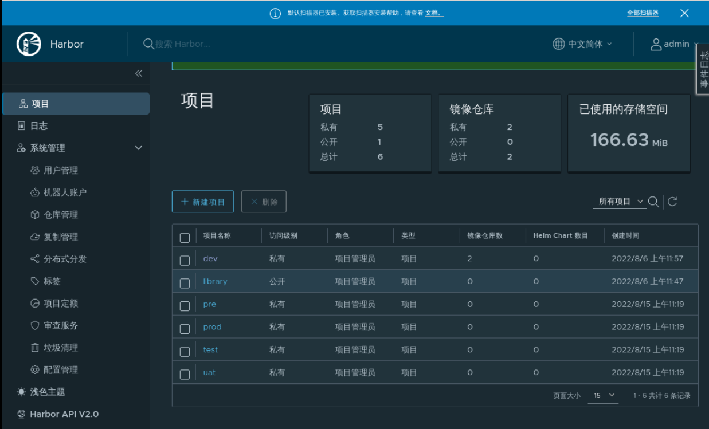

## Introduction to the environment

To complete this experiment, we need:

- Have an available Kubernetes cluster
- Have Gitlab, Jenkins, and Harbor installed

Branch structure of the `go-hello-world` project:

- dev: the development branch
- test: test branch
- uat: the debugging branch
- pre: pre-release branch
- prod: production branch

as follows:

Then go to kubernetes and use `kubectl create namespace xxx` to create the following namespace:

- dev: development environment
- test: test environment
- uat: the co-location environment
- pre: pre-release environment
- prod: production environment

> PS: The actual production may be a different cluster deployment of different environments, due to the limited conditions, here are done in a single cluster, but the implementation is the same.

The following project repositories are also created on Harbor, allowing images of different environments to be pushed to different repositories:

We achieve the following:

- Develop code commits to the code repository
- Automatically trigger the Jenkins pipeline
- The Jenkins pipeline gets branches based on the triggered information
- Deploy to different environments based on branches
