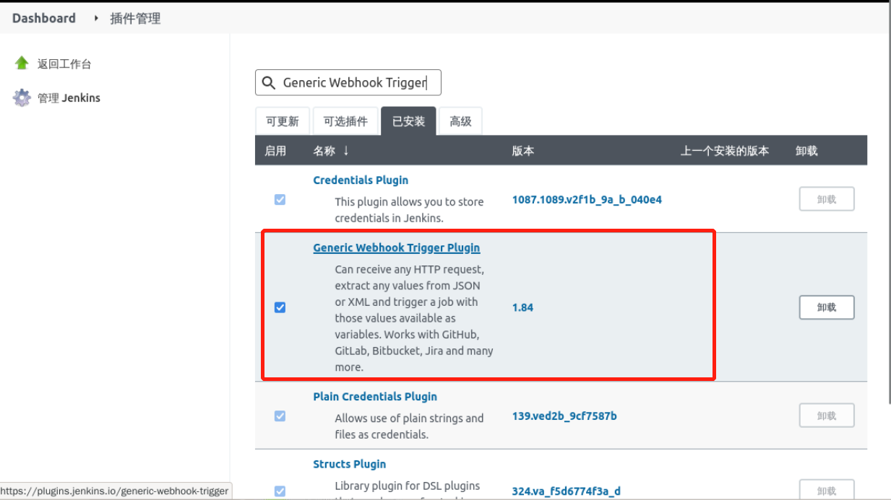

## Install plugins

We'll be using the `Generic Webhook Trigger` plugin to automatically fetch branches, which is described in How Jenkins Integrates with Gitlab.

Make sure the plugin is installed in **System Administration** -> **Plugin Management** -> **Installed**, as follows:

If it is not installed, search for `Generic Webhook Trigger` in **Optional Plugins** and install it, then restart Jenkins.
