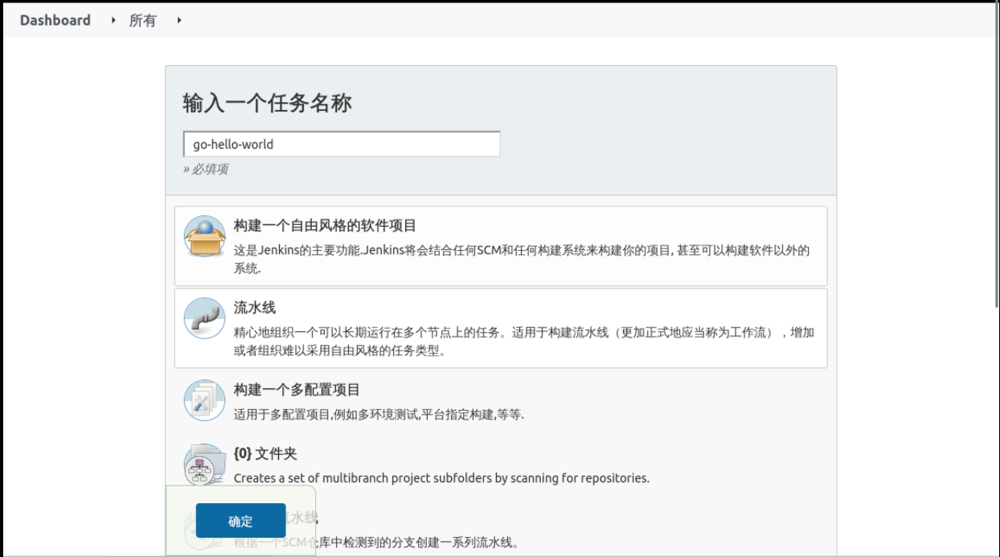
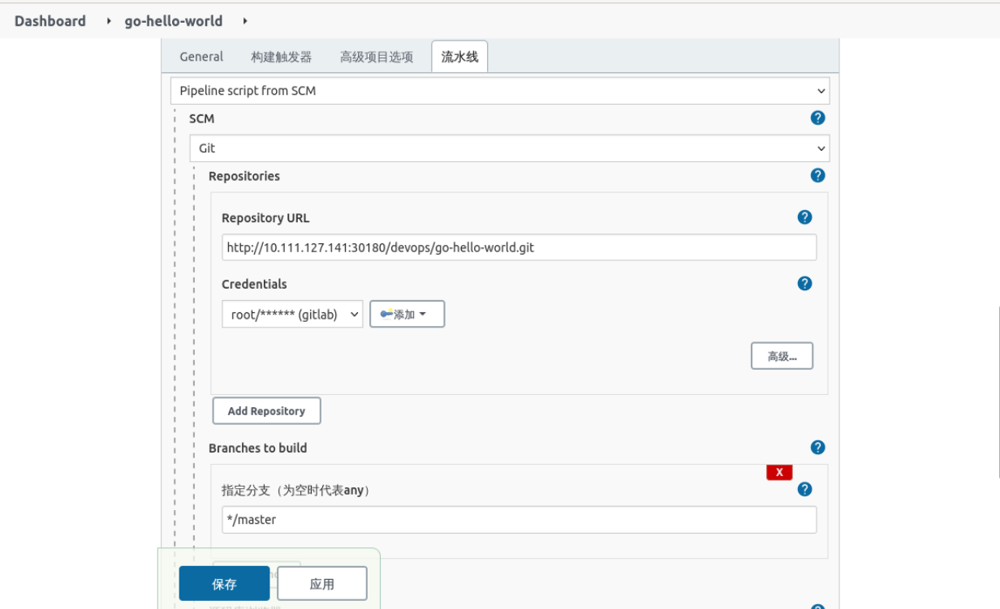
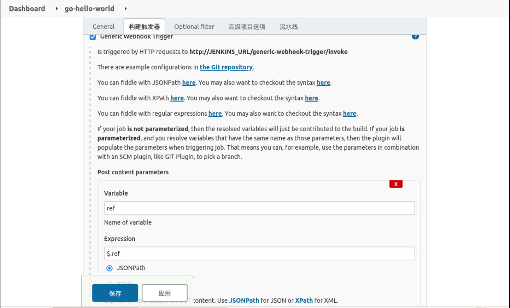
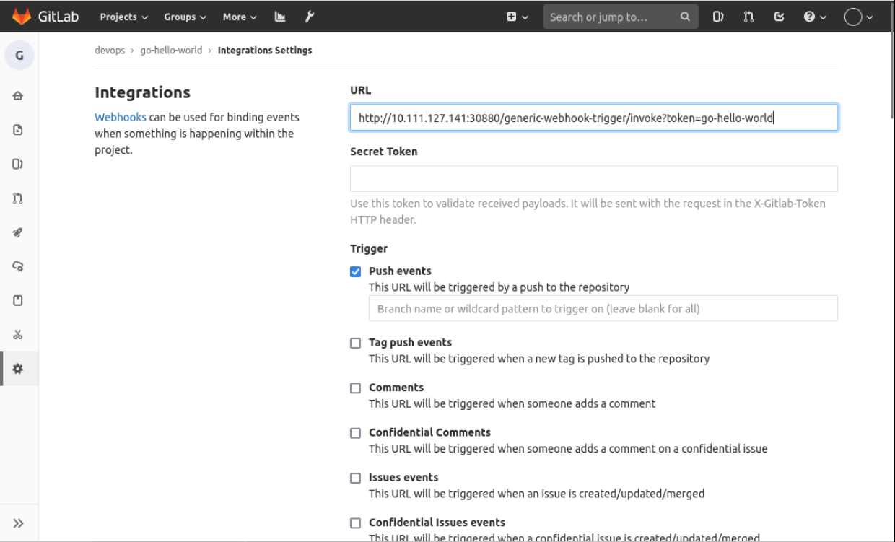
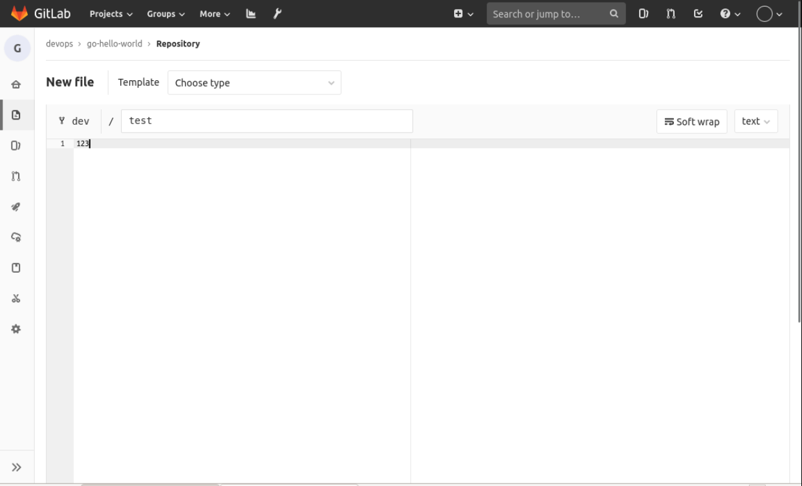
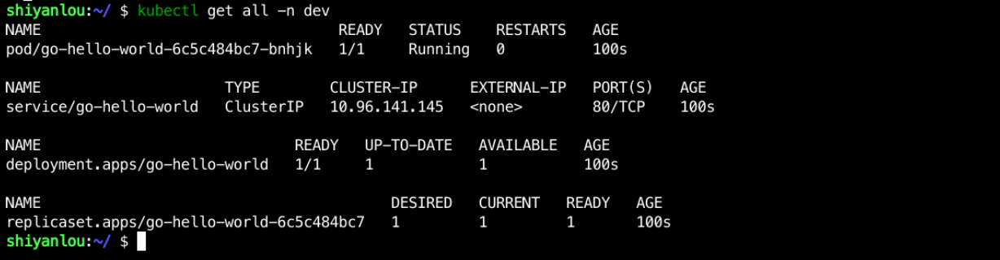
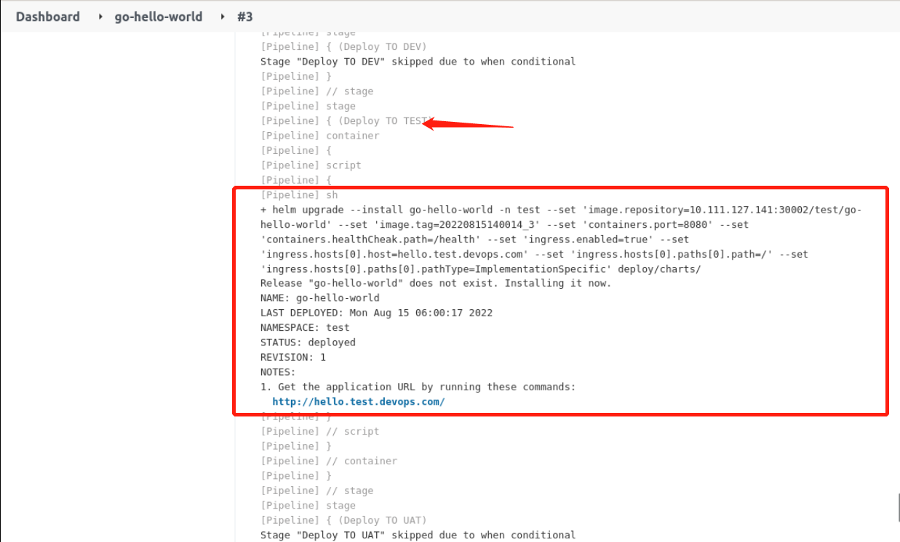

## Deploy the application

The above adds the required functionality. Now the whole pipeline is organized as follows:

```groovy
@Library('sharelibrary')

def tools = new org.devops.tools()

pipeline {
  agent {
        kubernetes {
            label "jenkins-slave-${UUUID.randomUUUID().toString()}"
            yaml """
apiVersion: v1
kind: Pod
spec.
  containers.
  - name: golang
    image: registry.cn-hangzhou.aliyuncs.com/coolops/golang:1.18.5
    command: ['cat']
    tty: true
  - name: docker
    image: registry.cn-hangzhou.aliyuncs.com/coolops/docker:19.03.11
    command: ['cat']
    tty: true
    volumeMounts.
      - name: indocker
        mountPath: /var/run/docker.sock
  - name: helm
    image: registry.cn-hangzhou.aliyuncs.com/coolops/helm-kubectl:3.2.4
    command: ['cat']
    tty: true
    volumeMounts.
      - name: kubeconfig
        mountPath: /root/.kube
  volumes.
    - name: indocker
      hostPath.
        path: "/var/run/docker.sock"
    - name: kubeconfig
      hostPath.
        path: "/home/shiyanlou/.kube"
"""
        }
    }

  environment{
    IMAGE_REPO = ""
    IMAGE_TAG = ""
  }

  triggers {
    GenericTrigger(
     genericVariables: [
      [key: 'ref', value: '$.ref']
     ].
     causeString: 'Triggered on $ref'.
     token: 'go-hello-world'.
     printContributedVariables: true.
     printPostContent: true.
     silentResponse: false.
     regexpFilterText: '$ref'.
     regexpFilterExpression: 'refs/heads/(dev|test|uat|pre|prod)'
    )
  }

  stages {
    stage('Get Code') {
        steps {
            checkout(scm)
        }
    }

    stage('Get Image Repo') {
        steps {
            script{
                BRANCH = ref - "refs/heads/"
                IMAGE_REPO = "10.111.127.141:30002/${BRANCH}/go-hello-world"
            }
        }
    }

    stage('Build Code') {
        steps {
            container('golang'){
                script{
                    sh '''
                        export GOPROXY=https://goproxy.cn
                        export GOOS=linux
                        export GOARCH=386
                        go mod tidy
                        go build -v -o . /go-hello-world
                    '''
                }
            }
        }
    }
    stage('Build And Push Image') {
        steps {
            container('docker'){
                script{

                    IMAGE_TAG = tools.createImageTag()
                    sh """
                        docker login 10.111.127.141:30002 -u admin -p Harbor12345
                        docker build -t ${IMAGE_REPO}:${IMAGE_TAG} -f Dockerfile .
                        docker push ${IMAGE_REPO}:${IMAGE_TAG}
                    """
                }
            }
        }
    }
    stage('Deploy TO DEV'){
        when {
            expression { ref ==~ 'refs/heads/dev' }
            }
        steps{
            container('helm'){
                script{
                    sh """
                        helm upgrade --install go-hello-world -n dev \
                        --set image.repository=${IMAGE_REPO} \
                        --set image.tag=${IMAGE_TAG} \
                        --set containers.port=8080 \
                        --set containers.healthCheak.path=/health \
                        --set ingress.enabled=true \
                        --set ingress.hosts[0].host=hello.dev.devops.com \
                        --set ingress.hosts[0].paths[0].path=/ \
                        --set ingress.hosts[0].paths[0].pathType=ImplementationSpecific deploy/charts/
                    """
                }
            }
        }
    }
    stage('Deploy TO TEST'){
        when {
            expression { ref ==~ 'refs/heads/test' }
            }
        steps{
            container('helm'){
                script{
                    sh """
                        helm upgrade --install go-hello-world -n test \
                        --set image.repository=${IMAGE_REPO} \
                        --set image.tag=${IMAGE_TAG} \
                        --set containers.port=8080 \
                        --set containers.healthCheak.path=/health \
                        --set ingress.enabled=true \
                        --set ingress.hosts[0].host=hello.test.devops.com \
                        --set ingress.hosts[0].paths[0].path=/ \
                        --set ingress.hosts[0].paths[0].pathType=ImplementationSpecific deploy/charts/
                    """
                }
            }
        }
    }
    stage('Deploy TO UAT'){
        when {
            expression { ref ==~ 'refs/heads/uat' }
            }
        steps{
            container('helm'){
                script{
                    sh """
                        helm upgrade --install go-hello-world -n uat \
                        --set image.repository=${IMAGE_REPO} \
                        --set image.tag=${IMAGE_TAG} \
                        --set containers.port=8080 \
                        --set containers.healthCheak.path=/health \
                        --set ingress.enabled=true \
                        --set ingress.hosts[0].host=hello.uat.devops.com \
                        --set ingress.hosts[0].paths[0].path=/ \
                        --set ingress.hosts[0].paths[0].pathType=ImplementationSpecific deploy/charts/
                    """
                }
            }
        }
    }
    stage('Deploy TO PRE'){
        when {
            expression { ref ==~ 'refs/heads/pre' }
            }
        steps{
            container('helm'){
                script{
                    sh """
                        helm upgrade --install go-hello-world -n pre \
                        --set image.repository=${IMAGE_REPO} \
                        --set image.tag=${IMAGE_TAG} \
                        --set containers.port=8080 \
                        --set containers.healthCheak.path=/health \
                        --set ingress.enabled=true \
                        --set ingress.hosts[0].host=hello.pre.devops.com \
                        --set ingress.hosts[0].paths[0].path=/ \
                        --set ingress.hosts[0].paths[0].pathType=ImplementationSpecific deploy/charts/
                    """
                }
            }
        }
    }
    stage('Deploy TO PROD'){
        when {
            expression { ref ==~ 'refs/heads/prod' }
            }
        steps{
            container('helm'){
                script{
                    sh """
                        helm upgrade --install go-hello-world -n prod \
                        --set image.repository=${IMAGE_REPO} \
                        --set image.tag=${IMAGE_TAG} \
                        --set containers.port=8080 \
                        --set containers.healthCheak.path=/health \
                        --set ingress.enabled=true \
                        --set ingress.hosts[0].host=hello.prod.devops.com \
                        --set ingress.hosts[0].paths[0].path=/ \
                        --set ingress.hosts[0].paths[0].pathType=ImplementationSpecific deploy/charts/
                    """
                }
            }
        }
    }
  }
}
```

Sync the above to the `Jenkinsfile` in the master branch of your Gitlab `go-hello-world` repository.

Then create a `go-hello-world` project on Jenkins and select the pipeline, as follows:



Then configure the pipeline and save it to exit as follows:



The first time you configure the pipeline, manually click **Build Now** and let it finish loading the configuration in the Jenkinsfile, mainly for the triggers, as follows



Configure the Webhook in the `go-hello-world` project in Gitlab. Click `settings` -> `integrations` and configure it as follows:



Then add a new file to the dev branch of your `go-hello-world` project on Gitlab, and write something random to commit, like



Observe if the `go-hello-world` project on Jenkins is triggered and if the deployment to the Dev environment is successful, and if the output looks like this:


And, you can see if the application was deployed successfully by `kubectl get all -n dev`, as follows:



In addition, you can also test if other branches are working as well, for example, I tested that the test branch is still working: `kubectl


