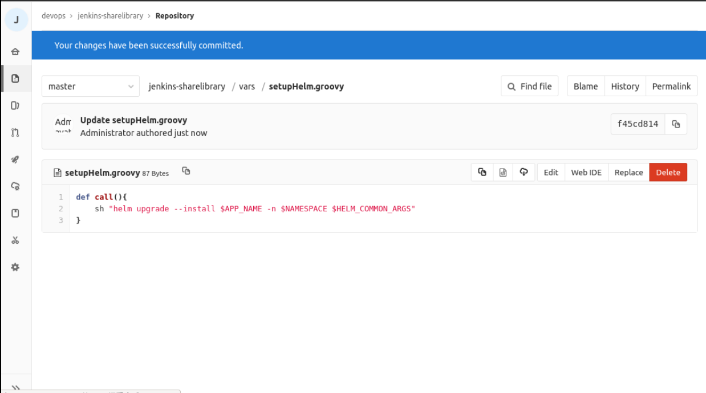
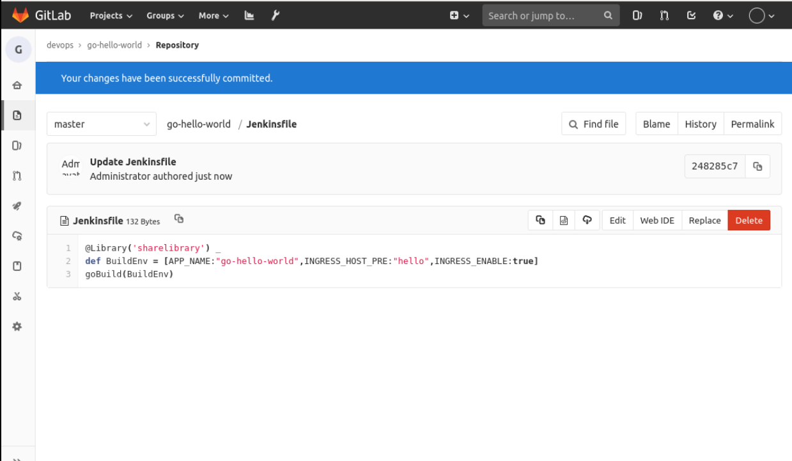

## Optimization pipeline

The above has completed the multi-branch release of the application, but only for a particular application, if there are similar applications, such as the same framework-based applications want to configure the pipeline, and to make changes to the above, and then all put into the code repository, then there is no way to make the above pipeline into a template? Which application to deploy only need to pass a few parameters?

This subsection, we will do this thing.

From the above pipeline, if it is the same framework of different projects, the need to change the following:

- Application name
- domain name
- helm command

To do this we define the environment variables as follows:

```groovy
    environment{
        APP_NAME = "${params.APP_NAME}"
        INGRESS_HOST_PRE = "${params.INGRESS_HOST_PRE}"
        INGRESS_ENABLE = "${params.INGRESS_ENABLE? params.INGRESS_ENABLE :false}"
        IMAGE_REPO = ""
        IMAGE_TAG = ""
        HELM_COMMON_ARGS= "--set ingress.enabled=$INGRESS_ENABLE \
                           --set containers.port=8080 \
                           --set containers.healthCheak.path=/health \
                           --set ingress.hosts[0].paths[0].path=/ \
                           --set ingress.hosts[0].paths[0].pathType=ImplementationSpecific deploy/charts/ "
    }
```

where:

- APP_NAME: indicates the application name
- INGRESS_HOST_PRE: indicates the domain name prefix, the unified format is "${INGRESS_HOST_PRE}.dev.devops.com", other environment analogy, if INGRESS_ENABLE is false, then do not need to pass this parameter
- INGRESS_ENABLE: indicates whether to use Ingress
- IMAGE_REPO: repository address, organized as "10.111.127.141:30002/${BRANCH}/${APP_NAME}"
- IMAGE_TAG: Mirror Tag
- HELM_COMMON_ARGS: Helm deployment parameters, extracting some parameters out

Then add the `vars/setupHelm.groovy` file to the `jenkins-sharelibrary` project in Gitlab, with the following contents:

```groovy
def call(){
    sh "helm upgrade --install $APP_NAME -n $NAMESPACE $HELM_COMMON_ARGS"
}
```



Then we deploy the stage, which can become the following:

```groovy
stage('Deploy TO DEV'){
        when {
            expression { ref ==~ 'refs/heads/dev' }
            }
        environment{
            NAMESPACE = 'dev'
            INGRESS_HOST = "${INGRESS_HOST_PRE}.dev.devops.com"
            HELM_COMMON_ARGS = "${HELM_COMMON_ARGS} --set ingress.hosts[0].host=$INGRESS_HOST --set image.repository=$IMAGE_REPO --set image.tag=$ IMAGE_TAG"
        }
        steps{
            container('helm'){
                script{
                    setupHelm()
                }
            }
        }
    }
    stage('Deploy TO TEST'){
        when {
            expression { ref ==~ 'refs/heads/test' }
            }
        environment{
            NAMESPACE = 'test'
            INGRESS_HOST = "${INGRESS_HOST_PRE}.test.devops.com"
            HELM_COMMON_ARGS = "${HELM_COMMON_ARGS} --set ingress.hosts[0].host=$INGRESS_HOST --set image.repository=$IMAGE_REPO --set image.tag=$ IMAGE_TAG"
        }
        steps{
            container('helm'){
                script{
                    setupHelm()
                }
            }
        }
    }
    stage('Deploy TO UAT'){
        when {
            expression { ref ==~ 'refs/heads/uat' }
            }
        environment{
            NAMESPACE = 'uat'
            INGRESS_HOST = "${INGRESS_HOST_PRE}.uat.devops.com"
            HELM_COMMON_ARGS = "${HELM_COMMON_ARGS} --set ingress.hosts[0].host=$INGRESS_HOST --set image.repository=$IMAGE_REPO --set image.tag=$ IMAGE_TAG"
        }
        steps{
            container('helm'){
                script{
                    setupHelm()
                }
            }
        }
    }
    stage('Deploy TO PRE'){
        when {
            expression { ref ==~ 'refs/heads/pre' }
            }
        environment{
            NAMESPACE = 'pre'
            INGRESS_HOST = "${INGRESS_HOST_PRE}.pre.devops.com"
            HELM_COMMON_ARGS = "${HELM_COMMON_ARGS} --set ingress.hosts[0].host=$INGRESS_HOST --set image.repository=$IMAGE_REPO --set image.tag=$ IMAGE_TAG"
        }
        steps{
            container('helm'){
                script{
                    setupHelm()
                }
            }
        }
    }
    stage('Deploy TO PROD'){
        when {
            expression { ref ==~ 'refs/heads/prod' }
            }
        environment{
            NAMESPACE = 'prod'
            INGRESS_HOST = "${INGRESS_HOST_PRE}.devops.com"
            HELM_COMMON_ARGS = "${HELM_COMMON_ARGS} --set ingress.hosts[0].host=$INGRESS_HOST --set image.repository=$IMAGE_REPO --set image.tag=$ IMAGE_TAG"
        }
        steps{
            container('helm'){
                script{
                    setupHelm()
                }
            }
        }
    }
```

In this way, we have parameterized the pipeline template. The overall modified pipeline template is as follows:

```groovy
def call(params){

def tools = new org.devops.tools()

pipeline {
  agent {
        kubernetes {
            label "jenkins-slave-${UUUID.randomUUUID().toString()}"
            yaml """
apiVersion: v1
kind: Pod
spec.
  containers.
  - name: golang
    image: registry.cn-hangzhou.aliyuncs.com/coolops/golang:1.18.5
    command: ['cat']
    tty: true
  - name: docker
    image: registry.cn-hangzhou.aliyuncs.com/coolops/docker:19.03.11
    command: ['cat']
    tty: true
    volumeMounts.
      - name: indocker
        mountPath: /var/run/docker.sock
  - name: helm
    image: registry.cn-hangzhou.aliyuncs.com/coolops/helm-kubectl:3.2.4
    command: ['cat']
    tty: true
    volumeMounts.
      - name: kubeconfig
        mountPath: /root/.kube
  volumes.
    - name: indocker
      hostPath.
        path: "/var/run/docker.sock"
    - name: kubeconfig
      hostPath.
        path: "/home/shiyanlou/.kube"
"""
        }
    }

    environment{
        APP_NAME = "${params.APP_NAME}"
        INGRESS_HOST_PRE = "${params.INGRESS_HOST_PRE}"
        INGRESS_ENABLE = "${params.INGRESS_ENABLE? params.INGRESS_ENABLE :false}"
        IMAGE_REPO = ""
        IMAGE_TAG = ""
        HELM_COMMON_ARGS= "--set ingress.enabled=$INGRESS_ENABLE \
                           --set containers.port=8080 \
                           --set containers.healthCheak.path=/health \
                           --set ingress.hosts[0].paths[0].path=/ \
                           --set ingress.hosts[0].paths[0].pathType=ImplementationSpecific deploy/charts/ "
    }

    triggers {
        GenericTrigger(
        genericVariables: [
        [key: 'ref', value: '$.ref']
        ].
        causeString: 'Triggered on $ref'.
        token: 'go-hello-world'.
        printContributedVariables: true.
        printPostContent: true.
        silentResponse: false.
        regexpFilterText: '$ref'.
        regexpFilterExpression: 'refs/heads/(dev|test|uat|pre|prod)'
        )
    }

    stages {
        stage('Get Code') {
            steps {
                checkout(scm)
            }
        }

        stage('Get Image Repo') {
            steps {
                script{
                    BRANCH = ref - "refs/heads/"
                    IMAGE_REPO = "10.111.127.141:30002/${BRANCH}/${APP_NAME}"
                }
            }
        }

        stage('Build Code') {
            steps {
                container('golang'){
                    script{
                        sh '''
                            export GOPROXY=https://goproxy.cn
                            export GOOS=linux
                            export GOARCH=386
                            go mod tidy
                            go build -v -o . /${APP_NAME}
                        '''
                    }
                }
            }
        }
        stage('Build And Push Image') {
            steps {
                container('docker'){
                    script{

                        IMAGE_TAG = tools.createImageTag()
                        sh """
                            docker login 10.111.127.141:30002 -u admin -p Harbor12345
                            docker build -t ${IMAGE_REPO}:${IMAGE_TAG} -f Dockerfile .
                            docker push ${IMAGE_REPO}:${IMAGE_TAG}
                        """
                    }
                }
            }
        }
        stage('Deploy TO DEV'){
            when {
                expression { ref ==~ 'refs/heads/dev' }
                }
            environment{
                NAMESPACE = 'dev'
                INGRESS_HOST = "${INGRESS_HOST_PRE}.dev.devops.com"
                HELM_COMMON_ARGS = "${HELM_COMMON_ARGS} --set ingress.hosts[0].host=$INGRESS_HOST --set image.repository=$IMAGE_REPO --set image.tag=$ IMAGE_TAG"
            }
            steps{
                container('helm'){
                    script{
                        setupHelm()
                    }
                }
            }
        }
        stage('Deploy TO TEST'){
            when {
                expression { ref ==~ 'refs/heads/test' }
                }
            environment{
                NAMESPACE = 'test'
                INGRESS_HOST = "${INGRESS_HOST_PRE}.test.devops.com"
                HELM_COMMON_ARGS = "${HELM_COMMON_ARGS} --set ingress.hosts[0].host=$INGRESS_HOST --set image.repository=$IMAGE_REPO --set image.tag=$ IMAGE_TAG"
            }
            steps{
                container('helm'){
                    script{
                        setupHelm()
                    }
                }
            }
        }
        stage('Deploy TO UAT'){
            when {
                expression { ref ==~ 'refs/heads/uat' }
                }
            environment{
                NAMESPACE = 'uat'
                INGRESS_HOST = "${INGRESS_HOST_PRE}.uat.devops.com"
                HELM_COMMON_ARGS = "${HELM_COMMON_ARGS} --set ingress.hosts[0].host=$INGRESS_HOST --set image.repository=$IMAGE_REPO --set image.tag=$ IMAGE_TAG"
            }
            steps{
                container('helm'){
                    script{
                        setupHelm()
                    }
                }
            }
        }
        stage('Deploy TO PRE'){
            when {
                expression { ref ==~ 'refs/heads/pre' }
                }
            environment{
                NAMESPACE = 'pre'
                INGRESS_HOST = "${INGRESS_HOST_PRE}.pre.devops.com"
                HELM_COMMON_ARGS = "${HELM_COMMON_ARGS} --set ingress.hosts[0].host=$INGRESS_HOST --set image.repository=$IMAGE_REPO --set image.tag=$ IMAGE_TAG"
            }
            steps{
                container('helm'){
                    script{
                        setupHelm()
                    }
                }
            }
        }
        stage('Deploy TO PROD'){
            when {
                expression { ref ==~ 'refs/heads/prod' }
                }
            environment{
                NAMESPACE = 'prod'
                INGRESS_HOST = "${INGRESS_HOST_PRE}.devops.com"
                HELM_COMMON_ARGS = "${HELM_COMMON_ARGS} --set ingress.hosts[0].host=$INGRESS_HOST --set image.repository=$IMAGE_REPO --set image.tag=$ IMAGE_TAG"
            }
            steps{
                container('helm'){
                    script{
                        setupHelm()
                    }
                }
            }
        }
    }
}
}
```

Then save it to the `vars/goBuild.groovy` file in the `jenkins-sharelibrary`, as follows:


Then, we change the Jenkinsfile in the `go-hello-world` project to the following:

```groovy
@Library('sharelibrary') _
def BuildEnv = [APP_NAME: "go-hello-world",INGRESS_HOST_PRE: "hello",INGRESS_ENABLE:true]
goBuild(BuildEnv)
```



Then modify some code in `go-hello-world` to see if the pipeline works properly.
