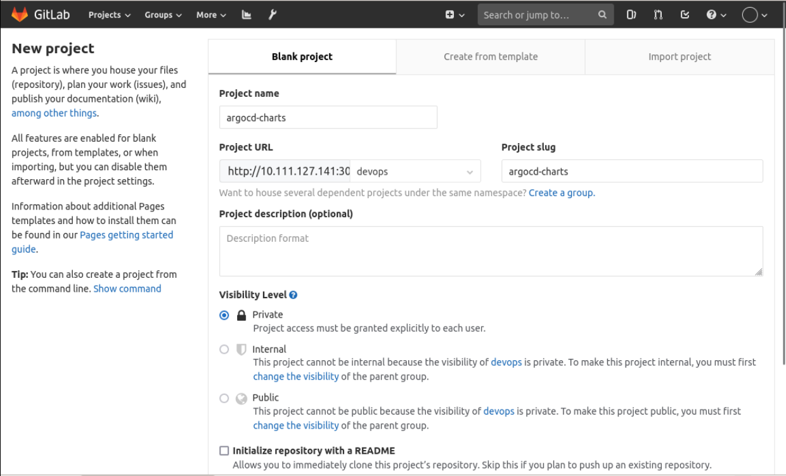

## Organize Helm Chart

We've already organized Helm Charts in the previous experiments, so why do we need to reorganize them here?

If we continue to put Helm Charts into the code repository, the version of the code will change, that is, the commit id will change, which is not conducive to maintaining the atomicity of the code repository.

Create an `argocd-charts` repository in the devops group in Gitlab, as follows:



The rules for storing our code under this project are: **project name/charts**

We'll start by putting the charts for the `go-hello-world` project into the repository.

Open a terminal and use the following command to do this:

```bash
cd /home/shiyanlou/Code
# Pull the go-hello-world code
git clone http://10.111.127.141:30180/devops/go-hello-world.git
# Pull the argocd-charts code
git clone http://10.111.127.141:30180/devops/argocd-charts.git
# Go to the argocd-charts directory
cd argocd-charts
# Create the go-hello-world/charts directory
mkdir go-hello-world/charts -p
# Copy the go-hello-world project's charts directory code to argocd-charts
cd /home/shiyanlou/Code
cp -r go-hello-world/deploy/charts/* argocd-charts/go-hello-world/charts
# Push the updated code from argocd-charts to Gitlab
cd argocd-charts
git add .
git commit -m "add go-hello-world helm charts"
git push
```

Then create a `go-hello-world/charts/dev.values.yaml` file in the `argocd-charts` project and write the following:

```yaml
image.
  repository: "10.111.127.141:30002/dev/go-hello-world"
  tag: "20220815150523_8"
containers.
  port: 8080
  healthCheck.
    enabled: true
    path: /health
ingress.
  enabled: true
  hosts.
    - host: hello.dev.devops.com
      paths.
        - path: /
          pathType: ImplementationSpecific
```

This is the values configuration for the `go-hello-world` application for the development environment.

> PS: The image address and image tag are adjusted according to the actual situation.
