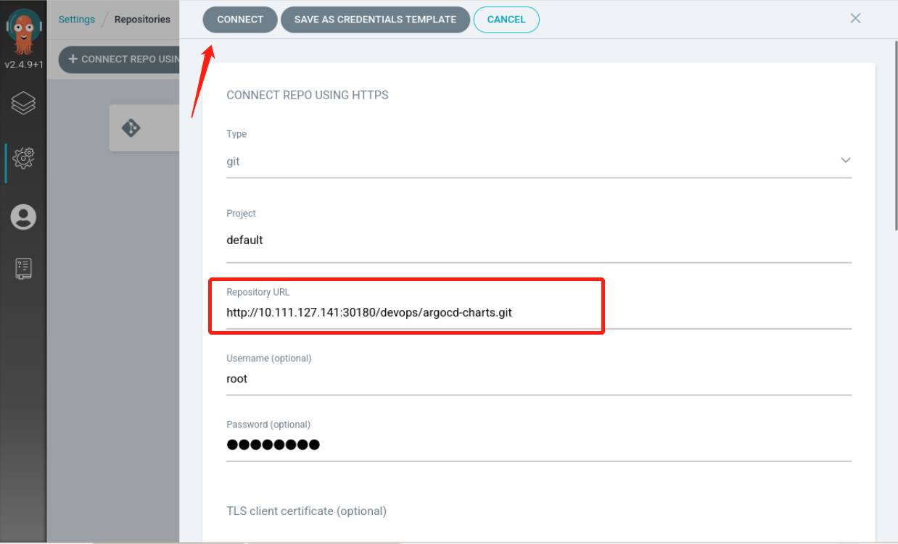
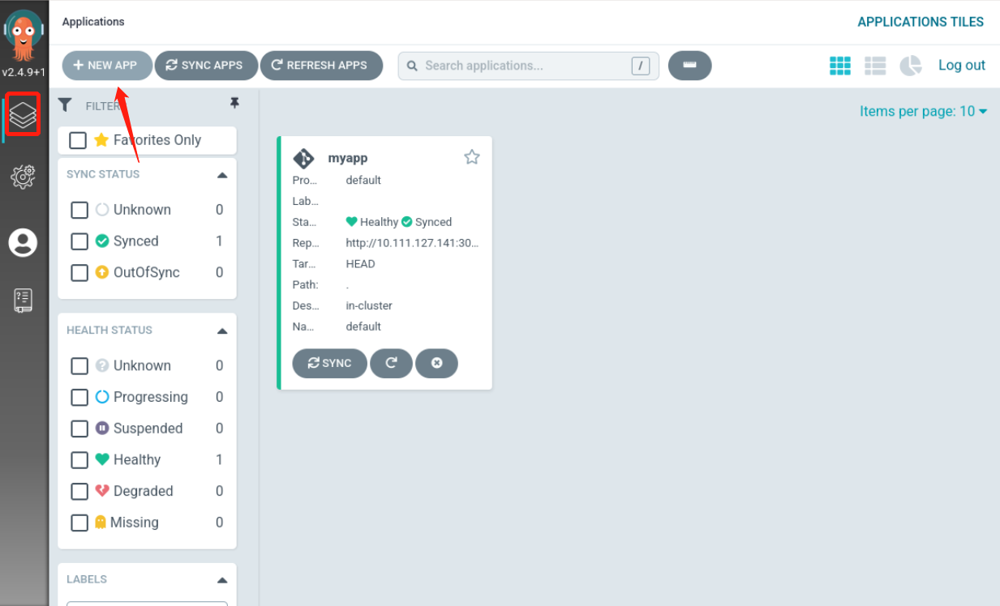
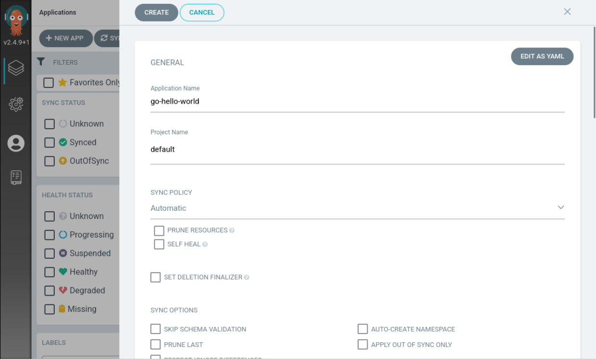

## Deploy the application on Argocd

First, add a repository to Argocd in `settings` -> `repositories`, as follows:

Configure `argocd-charts` code repository information as follows:

Then create the application, which we do directly on the Argocd UI.

- Click on `New APP` to create the application

- Enter the configuration information

Then click Save.
