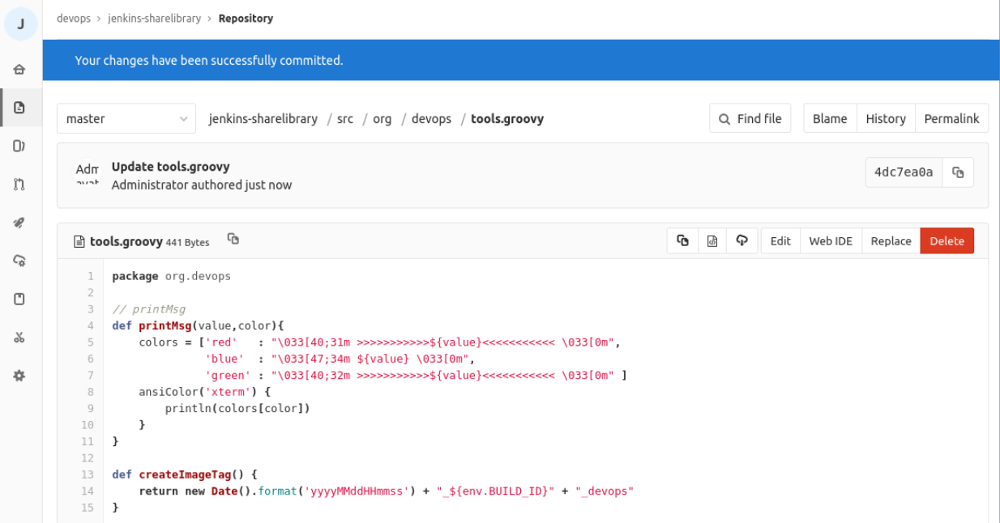
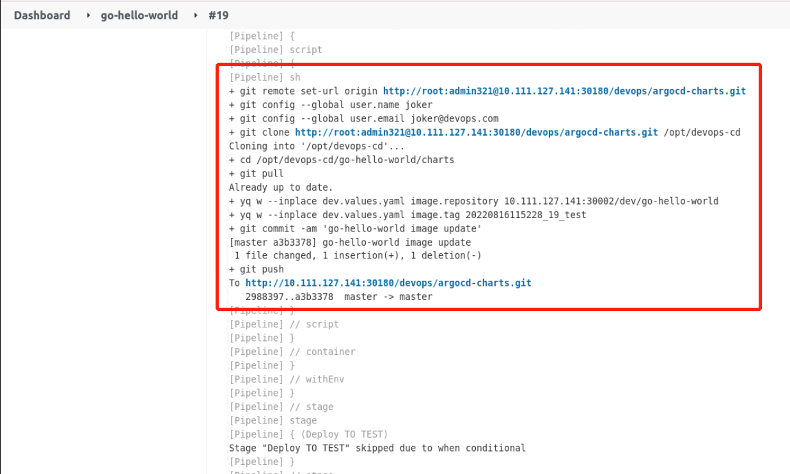
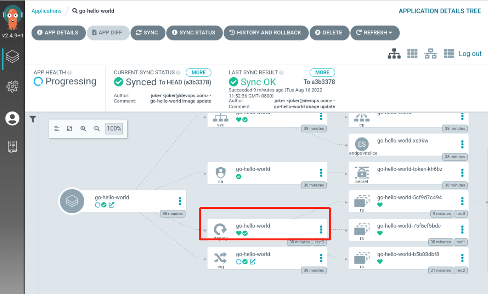

## Test

Before testing, change the Tag generation criteria for `tools.groovy` in `jenkins-sharelibrary`, as follows:

Add a `_devops` string to the end of it. If it's all numbers, it will become a long int when you push it to Gitlab, changing the Tag itself.

Then you can go to the dev branch of the `go-hello-world` project, make some random changes, and see if the pipeline on Jenkins is working properly:

Observe that the application deployment on Argocd is also normal, as follows:

> PS: On Argocd, we see that the application keeps spinning, because we have Ingress and the IP of the status state of this Ingress is empty, Argocd checksum does not pass, but it does not affect the usage.
