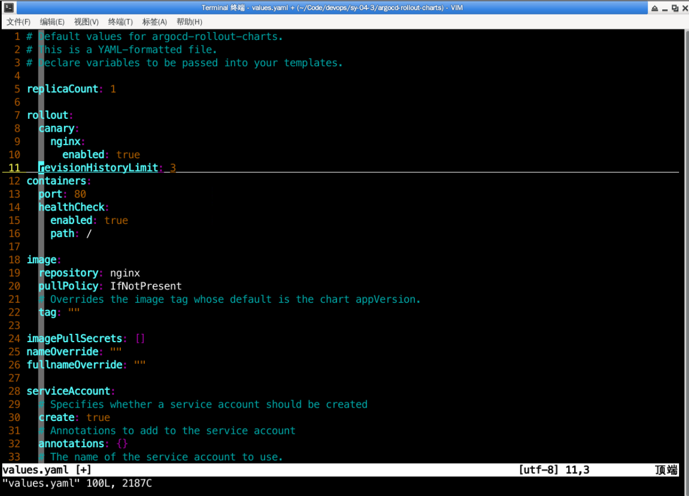
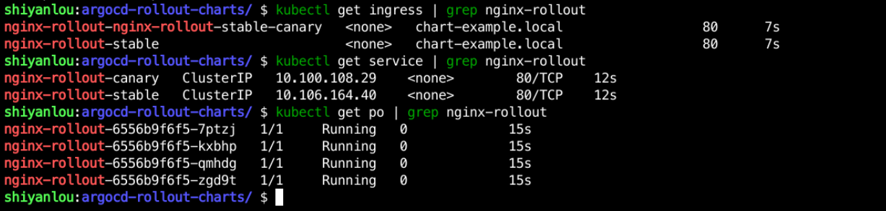
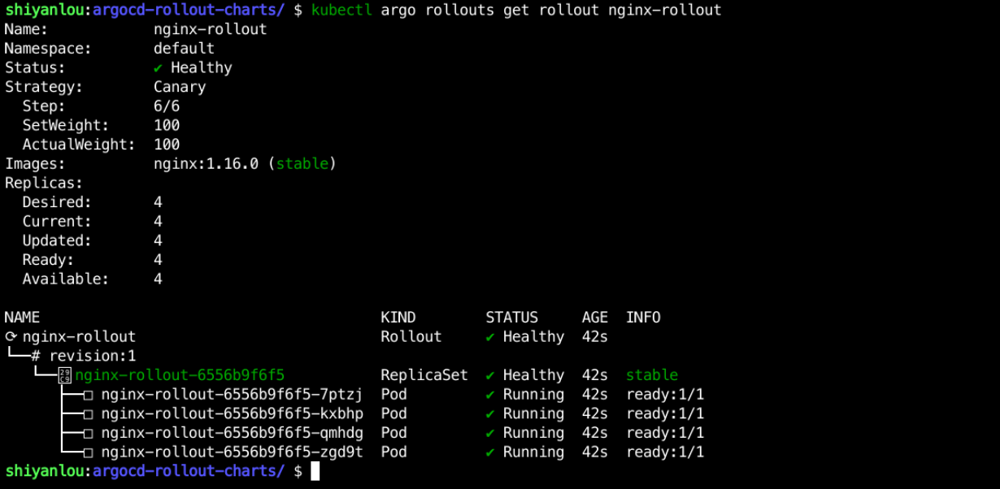
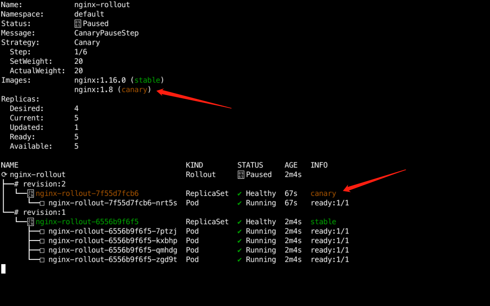
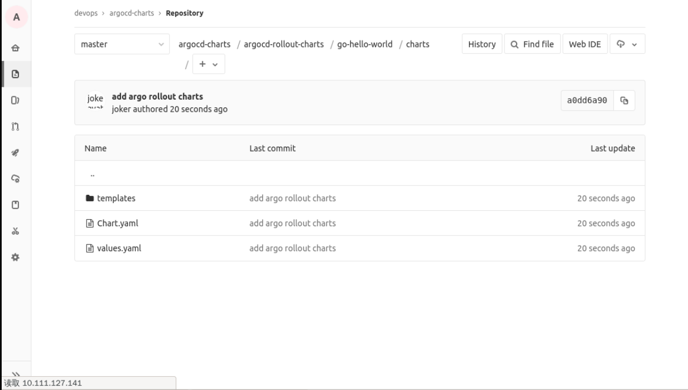

## Develop Helm Charts

We already know that if we want to use Argo rollouts we need to use the Rollout controller instead of the Deployment Controller, so we need to redevelop Helm Charts.

Create a `sy-04-3` directory under `/home/shiyanlou/Code/devops` with the following command:

```bash
mkdir /home/shiyanlou/Code/devops/sy-04-3
cd /home/shiyanlou/Code/devops/sy-04-3
```

Use `helm create argocd-rollout-charts`, as follows:


Go to the `templates` directory and create a `rollout.yaml` file and write the following:

```yaml
apiVersion: argoproj.io/v1alpha1
kind: Rollout
metadata.
  name: {{ .Release.Name }}
spec.
  replicas: {{ .Values.replicaCount }}
  strategy.
    canary.
      {{- if .Values.rollout.canary.nginx.enabled }}
        canaryService: {{ .Release.Name }}-canary
        stableService: {{ .Release.Name }}-stable
        trafficRouting.
          nginx.
            stableIngress: {{ .Release.Name }}-stable
      {{- end}}
        steps.
        - setWeight: 20
        - pause: {}
        - setWeight: 40
        - pause: { duration: 10 }
        - setWeight: 80
        - pause: { duration: 10 }
  revisionHistoryLimit: {{ .Values.rollout.revisionHistoryLimit }}
  selector.
    matchLabels.
      {{- include "argocd-rollout-charts.selectorLabels" . | nindent 6 }}
  template.
    metadata.
      {{- with .values.podAnnotations }}
      annotations.
        {{- toYaml .values.podAnnotations }}
      {{- end }}
      labels.
        {{- include "argocd-rollout-charts.selectorLabels" . | nindent 8 }}
    spec.
      {{- with .Values.imagePullSecrets }}
      imagePullSecrets.
        {{- toYaml . | nindent 8 }}
      {{- end}}
      serviceAccountName: {{ include "argocd-rollout-charts.serviceAccountName" . }}
      securityContext.
        {{- toYaml .Values.podSecurityContext | nindent 8 }}
      containers.
        - name: {{ .Release.Name }}
          securityContext.
            {{- toYaml .Values.podSecurityContext | nindent 12 }}
          image: "{{ .Values.image.repository }}:{{ .Values.image.tag | default .Chart.AppVersion }}"
          imagePullPolicy: {{ .Values.image.pullPolicy }}
          ports.
            - name: http
              containerPort: {{ .Values.containers.port }}
              protocol: TCP
          {{- if .Values.containers.healthCheck.enabled}}
          livenessProbe.
            httpGet.
              path: {{ { .Values.containers.healthCheck.path }}
              port: http
          readinessProbe.
            httpGet.
              path: {{ .Values.containers.healthCheck.path }}
              port: http
          {{- end}}
          resources.
            {{- toYaml .Values.resources | nindent 12 }}
      {{- with .Values.nodeSelector }}
      nodeSelector.
        {{- toYaml . | nindent 8 }}
      {{- end }}
      {{- with .Values.affinity }}
      affinity.
        {{- toYaml . | nindent 8 }}
      {{- end }}
      {{- with .values.tolerations }}
      tolerations.
        {{- toYaml . | nindent 8 }}
      {{- end }}

```

Delete `deploymeny.yaml` from this directory with the following command:

```bash
rm -f deployment.yaml
```

Overwrite the original `service.yaml` with the following:

```yaml
apiVersion: v1
kind: Service
metadata.
  name: {{ .Release.Name }}-canary
  labels.
    {{- include "argocd-rollout-charts.labels" . | nindent 4 }}
spec.
  type: {{ .Values.service.type }}
  ports.
    - port: {{ .values.service.port }}
      targetPort: http
      protocol: TCP
      name: http
  selector.
    {{- include "argocd-rollout-charts.selectorLabels" . | nindent 4 }}
---
apiVersion: v1
kind: Service
metadata.
  name: {{ .Release.Name }}-stable
  labels.
    {{- include "argocd-rollout-charts.labels" . | nindent 4 }}
spec.
  type: {{ .Values.service.type }}
  ports.
    - port: {{ .values.service.port }}
      targetPort: http
      protocol: TCP
      name: http
  selector.
    {{- include "argocd-rollout-charts.selectorLabels" . | nindent 4 }}
```

Then overwrite the original `ingress.yaml` with the following:

```yaml
{{- if .Values.ingress.enabled -}}
{{- $fullName := .Release.Name -}}
{{- $svcPort := .Values.service.port -}}
{{- if and .Values.ingress.className (not (semverCompare ">=1.18-0" .Capabilities.KubeVersion.GitVersion)) }}
  {{- if not (hasKey .Values.ingress.annotations "kubernetes.io/ingress.class") }}
  {{- $_ := set .Values.ingress.annotations "kubernetes.io/ingress.class" .Values.ingress.className}}
  {{- end }}
{{- end }}
{{- if semverCompare ">=1.19-0" .Capabilities.KubeVersion.GitVersion -}}
apiVersion: networking.k8s.io/v1
{{- else if semverCompare ">=1.14-0" .Capabilities.KubeVersion.GitVersion -}}
apiVersion: networking.k8s.io/v1beta1
{{- else -}}
apiVersion: extensions/v1beta1
{{- end }}
kind: Ingress
metadata.
  name: {{ $fullName }}-stable
  labels.
    {{- include "argocd-rollout-charts.labels" . | nindent 4 }}
  {{- with .values.ingress.annotations }}
  annotations.
    {{- toYaml . | nindent 4 }}
  {{- end }}
spec.
  {{- if and .Values.ingress.className (semverCompare ">=1.18-0" .Capabilities.KubeVersion.GitVersion) }}
  ingressClassName: {{ .Values.ingress.className }}
  {{- end }}
  {{- if .Values.ingress.tls }}
  tls.
    {{- range .Values.ingress.tls }}
    - hosts.
        {{- range .hosts }}
        - {{ . | quote }}
        {{- end }}
      secretName: {{ .secretName }}
    {{- end }}
  {{- end }}
  rules.
    {{- range .values.ingress.hosts }}
    - host: {{ .host | quote }}
      http.
        paths.
          {{- range .paths }}
          - path: {{ .path }}
            {{- if and .pathType (semverCompare ">=1.18-0" $.Capabilities.KubeVersion.GitVersion) }}
            pathType: {{ .pathType }}
            {{- end }}
            backend.
              {{- if semverCompare ">=1.19-0" $.Capabilities.KubeVersion.GitVersion }}
              service.
                name: {{ $fullName }}-stable
                port.
                  number: {{ $svcPort }}
              {{- else }}
              serviceName: {{ $fullName }}-stable
              servicePort: {{ $svcPort }}
              {{- end }}
          {{- end }}
    {{- end }}
{{- end }}

```

Finally, add the following to `values.yaml`:

```yaml
rollout.
  canary.
    nginx.
      enabled: true
  revisionHistoryLimit: 3
containers.
  port: 80
  healthCheck.
    enabled: true
    path: /
```



First, use this Helm Charts installation test to see if there are any problems with the developed Helm Charts, with the following command:

```bash
cd /home/shiyanlou/Code/devops/sy-04-3/argocd-rollout-charts
helm upgrade --install nginx-rollout --set ingress.enabled=true --set replicaCount=4 .
```


Then see if Service, Ingress, and Pod start properly, as follows:



Use `kubectl argo rollouts get rollout nginx-rollout` to see the status, as follows:



Then use `kubectl argo rollouts set image nginx-rollout nginx-rollout=nginx:1.8` to update the application, as you can see from the following image: `kubectl argo rollouts set image nginx-rollout nginx-rollout=nginx:1.8` to update the application properly:



Then put it in the `argocd-rollous-charts/go-hello-world/charts` directory of the Gitlab `argocd-charts`, as follows



Then create `dev.values.yaml` in that directory, which looks like this

```yaml
replicaCount: 4
image.
  repository: "10.111.127.141:30002/dev/go-hello-world"
  tag: "20220815150523_8"
rollout.
  canary.
    nginx.
      enabled: true
  revisionHistoryLimit: 3
containers.
  port: 8080
  healthCheck.
    enabled: true
    path: /health
ingress.
  enabled: true
  hosts.
    - host: hello-rollout.dev.devops.com
      paths.
        - path: /
          pathType: ImplementationSpecific
```


> PS: Mirror repository address and mirror Tag are adjusted according to the actual situation.
