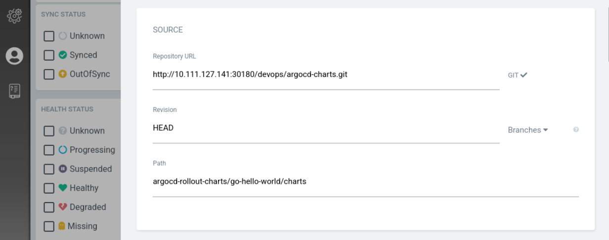
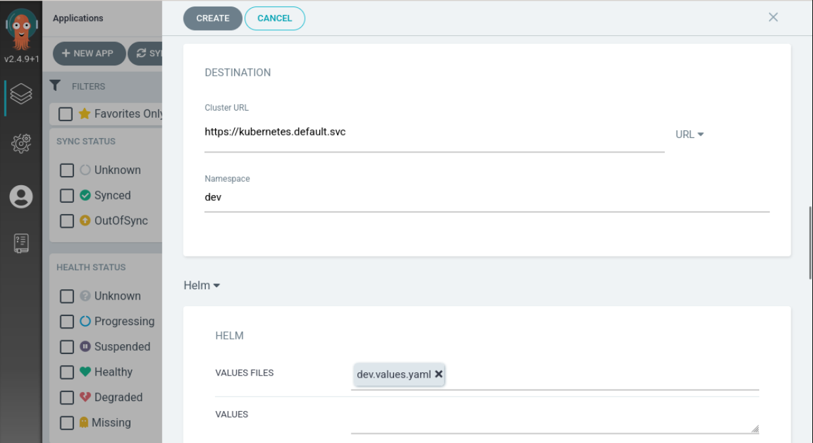
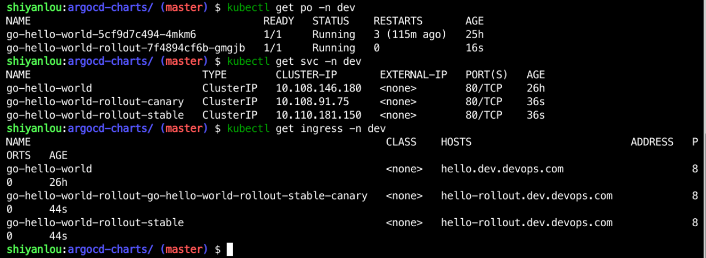
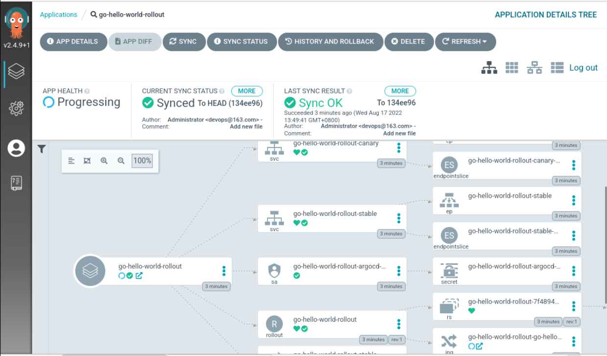

## Create application on Argocd

- Add the repository information as follows:

- Create application

Then click Create to complete the creation of the application. You can see the deployment information as follows:

The message you see on Argocd is as follows

