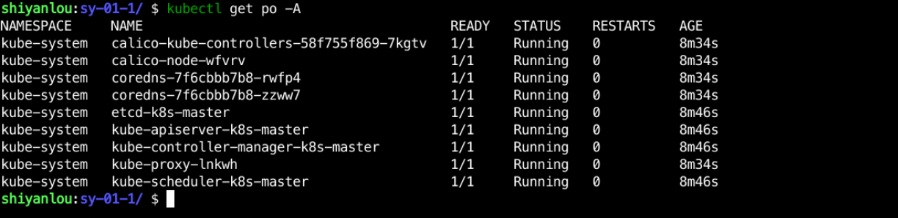
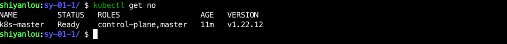

### Install Kubernetes

Follow the official steps to enter the lab environment and open the console.

(1) Prepare the installation script
Create the `sy-01-1` folder in the `/home/shiyanlou/Code/` directory with the following command:

```bash
mkdir /home/shiyanlou/Code/sy-01-1 -p
cd /home/shiyanlou/Code/sy-01-1
```

Then create the `k8s-init.sh` script in the `/home/shiyanlou/Code/sy-01-1` directory and enter the following:

> kubectl, kubeadm, kubelet and other components are already installed in the Bluebridge Cloud class environment.

```bash
#! /bin/bash

sudo kubeadm init --kubernetes-version=1.22.12 \
--pod-network-cidr 192.168.0.0/16 \
--image-repository registry.aliyuncs.com/google_containers
sudo rm -rf ~/.kube/
mkdir ~/.kube
sudo cp -i /etc/kubernetes/admin.conf $HOME/.kube/config
sudo chown $(id -u):$(id -g) $HOME/.kube/config
wget -q https://labfile.oss.aliyuncs.com/courses/10022/tigera-operator.yaml
wget -q https://labfile.oss.aliyuncs.com/courses/10022/custom-resources.yaml
kubectl create -f tigera-operator.yaml
kubectl create -f custom-resources.yaml
kubectl taint node k8s-master node-role.kubernetes.io/master-
```

> Executing this script may fail to initialize due to pulling calico related images timeout, in this case, you can first run the following command to pull our hosted related images.

```bash
# pull mirrors
docker pull registry.cn-hangzhou.aliyuncs.com/mandysa/typha:v3.24.0
docker pull registry.cn-hangzhou.aliyuncs.com/mandysa/pod2daemon-flexvol:v3.24.0
docker pull registry.cn-hangzhou.aliyuncs.com/mandysa/node:v3.24.0
docker pull registry.cn-hangzhou.aliyuncs.com/mandysa/csi:v3.24.0
docker pull registry.cn-hangzhou.aliyuncs.com/mandysa/cni:v3.24.0
docker pull registry.cn-hangzhou.aliyuncs.com/mandysa/apiserver:v3.24.0
docker pull registry.cn-hangzhou.aliyuncs.com/mandysa/kube-controllers:v3.24.0
docker pull registry.cn-hangzhou.aliyuncs.com/mandysa/node-driver-registrar:v3.24.0
docker pull registry.cn-hangzhou.aliyuncs.com/mandysa/pod2daemon-flexvol:v3.24.0
# Modify Tag
docker tag registry.cn-hangzhou.aliyuncs.com/mandysa/typha:v3.24.0 calico/typha:v3.24.0
docker tag registry.cn-hangzhou.aliyuncs.com/mandysa/pod2daemon-flexvol:v3.24.0 calico/pod2daemon-flexvol:v3.24.0
docker tag registry.cn-hangzhou.aliyuncs.com/mandysa/node:v3.24.0 calico/node:v3.24.0
docker tag registry.cn-hangzhou.aliyuncs.com/mandysa/csi:v3.24.0 calico/csi:v3.24.0
docker tag registry.cn-hangzhou.aliyuncs.com/mandysa/cni:v3.24.0 calico/cni:v3.24.0
docker tag registry.cn-hangzhou.aliyuncs.com/mandysa/apiserver:v3.24.0 calico/apiserver:v3.24.0
docker tag registry.cn-hangzhou.aliyuncs.com/mandysa/kube-controllers:v3.24.0 calico/kube-controllers:v3.24.0
docker tag registry.cn-hangzhou.aliyuncs.com/mandysa/node-driver-registrar:v3.24.0 calico/node-driver-registrar:v3.24.0
# Remove redundant images Tag
docker rmi registry.cn-hangzhou.aliyuncs.com/mandysa/typha:v3.24.0
docker rmi registry.cn-hangzhou.aliyuncs.com/mandysa/pod2daemon-flexvol:v3.24.0
docker rmi registry.cn-hangzhou.aliyuncs.com/mandysa/node:v3.24.0
docker rmi registry.cn-hangzhou.aliyuncs.com/mandysa/csi:v3.24.0
docker rmi registry.cn-hangzhou.aliyuncs.com/mandysa/cni:v3.24.0
docker rmi registry.cn-hangzhou.aliyuncs.com/mandysa/apiserver:v3.24.0
docker rmi registry.cn-hangzhou.aliyuncs.com/mandysa/kube-controllers:v3.24.0
docker rmi registry.cn-hangzhou.aliyuncs.com/mandysa/node-driver-registrar:v3.24.0
```

Then use the `bash k8s-init.sh` command directly to execute the installation. The installation is successful if the following message is output:


Use `kubectl get pod -A` to see how the pod is starting up, if it all changes to `running` then the cluster initialization is complete.

> This process takes a long time, so please be patient.



After the cluster is started, you can use `kubectl get node` to view the cluster information as follows:



You can also use `kubectl get node -o wide` to see more detailed node information.


> PS: Remember the IP information of the node, that is, the IP address in the INTERNAL-IP column, just remember one.
