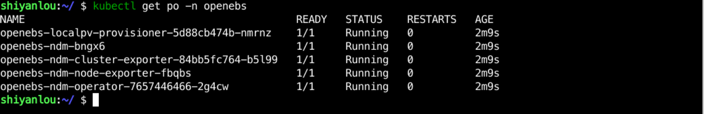

### Install persistent storage

After installing the cluster, we need to install the persistent storage to persist the stateful application data.

There are many options for storage, such as Ceph, NFS, GlusterFS, etc. But since this is a Kubernetes cluster built on a single server, we'll just use Local storage.

For convenience, we use [OpenEBS](https://github.com/openebs/openebs) to manage local storage. Just use the following command to install it in Kubernetes.

```bash
kubectl apply -f https://openebs.github.io/charts/openebs-operator.yaml
```

After the command is executed, an `` openebs`'' namespace will be created, and all the services required by OpenEBS will be created under this namespace. You can use  ``kubectl get pod -n openebs` ' to check the status of the services, and when the status is ``Running `', it means it is normal, as follows:



Use `kubectl get sc` to see the information about the cluster's `StorageClass`, which we need to use to create the PV.


Use the following command to set `openebs-hostpath` to `default` so that in the case of using StorageClass, if no StorageClass is configured, the default one is used, as follows:

```bash
kubectl patch storageclass openebs-hostpath -p '{"metadata": {"annotations":{"storageclass.kubernetes.io/is-default-class": "true"}}}'
```
