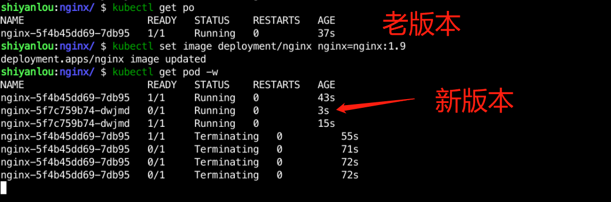
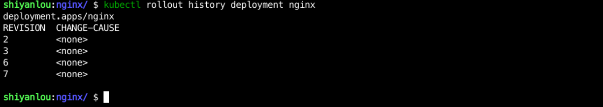
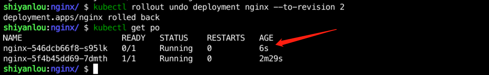

### Develop and use Deployment

Deployment is a controller in Kubernetes that is used to deploy stateless applications. It allows you to quickly deploy, update, and roll back applications.

The standard Deployment includes health detection, graceful exit, application probing, affinity or anti-affinity, and so on, on which we build the Deployment for Nginx.

Create a `sy-01-1` directory in the `/home/shiyanlou/Code/devops` directory and enter it with the following command:

```bash
mkdir /home/shiyanlou/Code/devops/sy-01-1
cd /home/shiyanlou/Code/devops/sy-01-1
```

Create the `nginx-deploy.yaml` file in the `/home/shiyanlou/Code/devops/sy-01-1` directory and write the following:

```yaml
apiVersion: apps/v1
kind: Deployment
metadata.
  labels.
    app: nginx
  name: nginx
spec.
  progressDeadlineSeconds: 600
  replicas: 1
  revisionHistoryLimit: 10
  selector.
    matchLabels.
      app: nginx
  strategy.
    rollingUpdate.
      maxSurge: 25%
      maxUnavailable: 25%
    type: RollingUpdate
  template.
    metadata.
      labels.
        app: nginx
    spec.
      containers.
        - image: nginx:1.8
          imagePullPolicy: IfNotPresent
          name: nginx
          lifecycle.
            preStop.
              exec.
                command.
                  - /bin/sh
                  - -c
                  - sleep 15
          resources.
            requests.
              cpu: "0.5"
              memory: 10M
            limits.
              cpu: "0.5"
              memory: 10M
          readinessProbe.
            failureThreshold: 3
            httpGet.
              path: /
              port: http
              scheme: HTTP
            initialDelaySeconds: 10
            periodSeconds: 10
            successThreshold: 1
            timeoutSeconds: 3
          ports.
            - containerPort: 80
              name: http
              protocol: TCP
```

Then use `kubectl apply -f nginx-deploy.yaml` to deploy the application, and use `kubectl get pod` to check the application deployment status, when the Pod status changes to `running` it means the deployment is successful, as follows:


#### Application update

The above deployment of Nginx is version 1.8. If a new version 1.9 has been developed, there are two main ways to update it:

- Use the `kubectl set image` command to update
- Modify the YAML manifest file and update it again using the `kubectl apply` command

The first update method is used here, with the following command:

```bash
kubectl set image deployment/nginx nginx=nginx:1.9
```

where in `deployment/nginx`, `deployment` represents the Deployment controller, `nginx` represents the deployment name of the application, and in `nginx=nginx:1.9`, `nginx` represents the nginx container name and `nginx:1.9` represents the image address.

After updating, you can use `kubectl get pod -w` to observe the upgrade process as follows:



You can see that after the new version starts, the old version slowly exits.

#### Application rollback

Application updates and rollbacks work in tandem with each other, and update and rollback operations occur from time to time in the enterprise.

In Kubernetes, we can use the `kubectl rollout` command to perform rollbacks.

First, use the `kubectl rollout history deployment nginx` command to view the history version, as follows:



Our current version is `7`, so to roll back directly to the previous version, you can use the following command:

```bash
kubectl rollout undo deployment nginx
```

After executing the command, you can use `kubectl get pod` to see if the application is rolled back for updates, as follows:


If you want to roll back to a specific version, for example to roll back to version `2`, then use the following command directly:

```bash
kubectl rollout undo deployment nginx --to-revision 2
```

After executing the command, you can see the following display:


