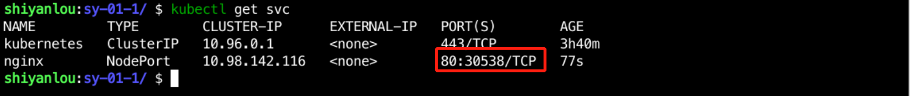

### Develop and use Service

Deployment alone only means deploying the application to Kubernetes, and the IP address of a Pod created through Deployment is variable, meaning that it may change with each update or rollback, making it impossible for other applications to consistently call a fixed IP. Kubernetes provides load to Pods via Service.

There are four types of services, Cluster IP, LoadBalance, NodePort, and ExternalName, of which Cluster IP is the default type.

- Cluster IP: Expose the service through the internal IP of the cluster, the default is this type, select this value, this Service service can only be accessed through the internal cluster;
- LoadBalance: Use the cloud provider's load balancer to expose the service externally. Select this value and the external load balancer can route to the NodePort service and the Cluster IP service;
- NodePort: as the name implies is the Port on the Node, if this value is selected, this Service can access this Service service through `NodeIP:NodePort`, the NodePort will be routed to the Cluster IP service, this Cluster IP will be automatically created through the request;;
- ExternalName: By returning the CNAME and its value, the service can be mapped to the contents of the externalName field without any type agent being created, and can be used to access other Pods within the cluster that do not have Labels, as well as to access Services in other NameSpace.

This experiment mainly uses ClusterIP and NodePort, other types can be studied on their own on the official website.

Create the `nginx-svc.yaml` file in the `/home/shiyanlou/Code/devops/sy-01-1` directory and write the following:

```yaml
apiVersion: v1
kind: Service
metadata.
  name: nginx
  labels.
    app: nginx
spec.
  type: ClusterIP
  selector.
    app: nginx
  ports.
    - name: http
      port: 80
```

Then use `kubectl apply -f nginx-svc.yaml` to create the Service, and use `kubectl get service` to check the Service status after execution, as follows


You can see that the generated CLUSTER-IP is `10.98.142.116`, which can be used inside the cluster to access the backend pod directly, but it cannot be accessed outside the cluster, so if you want to access it, you need to change the Type type in the Service to NodePort, as follows

```yaml
apiVersion: v1
kind: Service
metadata.
  name: nginx
  labels.
    app: nginx
spec.
  type: NodePort
  selector.
    app: nginx
  ports.
    - name: http
      port: 80
```

Re-use the `kubectl apply -f nginx-svc.yaml` command to update the Service, and the updated state will be as follows



You can see that a port `30538` has been generated, which is at the node level, so we can access it in the browser via `IP:30538`, as follows


> PS: The NodePort generated by different clusters is not the same, and the node IP may also be different, so make appropriate adjustments according to your own environment when accessing.
