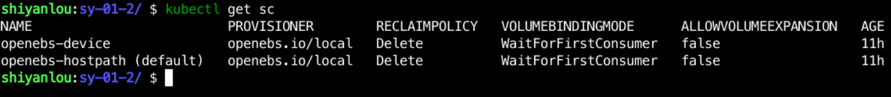

## Prep

- Have an available Kubernetes cluster
- Kubernetes has persistent storage
- Familiarity with basic Kubernetes operations

Create a `sy-01-2` directory in the `/home/shiyanlou/Code/devops` directory, where all configuration files for this experiment will be saved, with the following command:

```bash
mkdir -p /home/shiyanlou/Code/devops/sy-01-2
cd /homt/shiyanlou/Code/devops/sy-01-2
```

In the first experiment, we have initialized the Kubernetes environment and the environment comes with a `local` storage and also created the `StroageClass` which can be viewed using `kubectl get sc` as follows:


