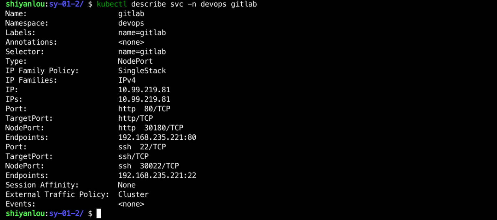

### Creating a Gitlab Service

Create a `gitlab-svc.yaml` file in the `/home/shiyanlou/Code/devops/sy-01-2` directory, and write the following:

```yaml
apiVersion: v1
kind: Service
metadata.
  name: gitlab
  namespace: devops
  labels.
    name: gitlab
spec.
  ports.
    - name: http
      port: 80
      targetPort: http
      nodePort: 30180
    - name: ssh
      port: 22
      targetPort: ssh
      nodePort: 30022
  selector.
    name: gitlab
  type: NodePort
```

> PS: Gitlab's Service uses NodePort here because we need to access it from the outside.

Then use `kubectl apply -f gitlab-svc.yaml` to create the Service, and then use `kubectl get svc -n devops gitlab` to see how the Service was created, as follows:


And you can use `kubectl describe svc -n devops gitlab` to see the details of the Service, as follows:



At this point, Gitlab deployment is complete.
