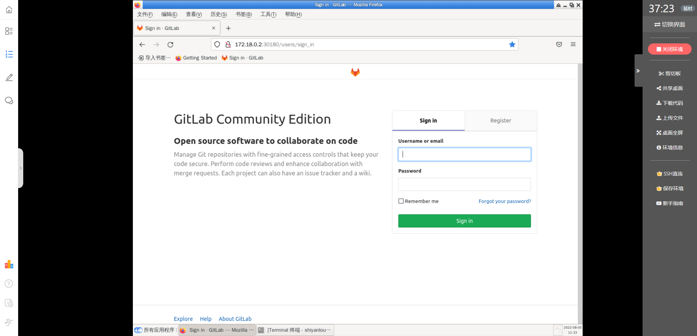
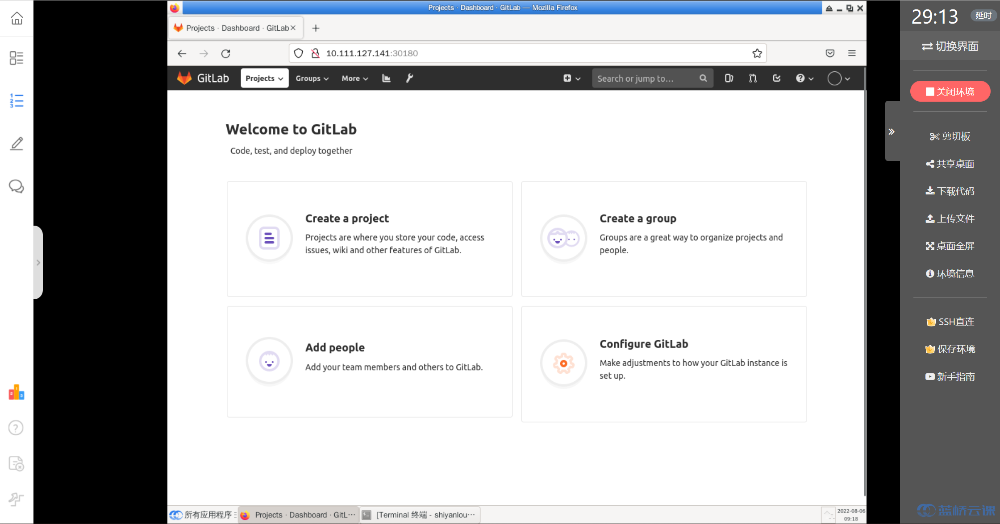

### Login

You've already deployed Gitlab, so we'll use `NodeIP:NodePort` to access it directly, instead of Ingress, to make it easier to experiment later. 30180`, you can access it by typing `http://10.111.127.141:30180` in your browser.

> PS: Since everyone's environment may be different, adjust the Gitlab access address according to your situation.

Then enter your username/password: `root/admin321` to log in to Gitlab, and you will see the following after logging in:

