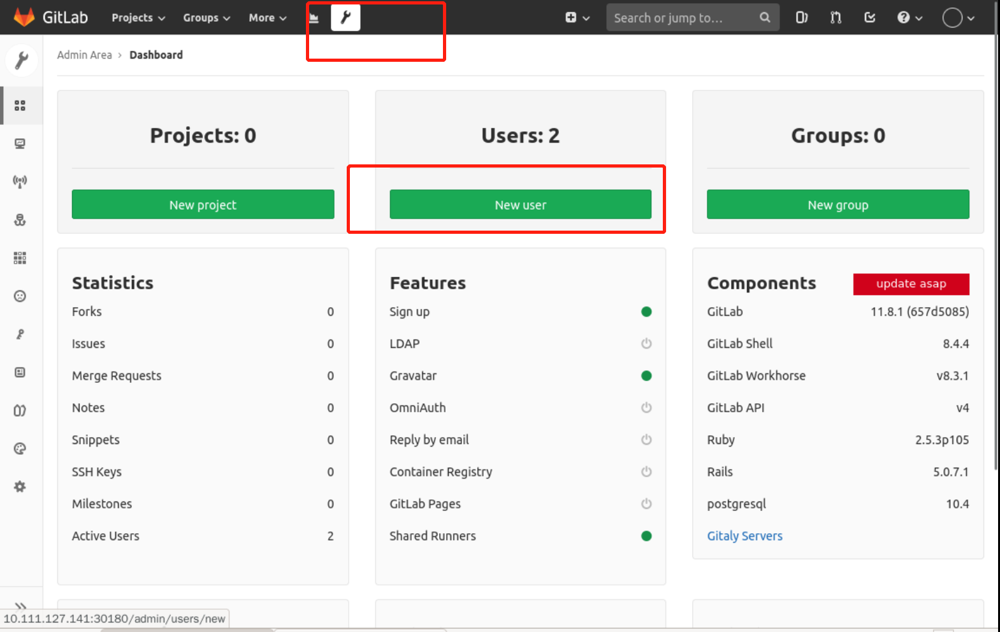
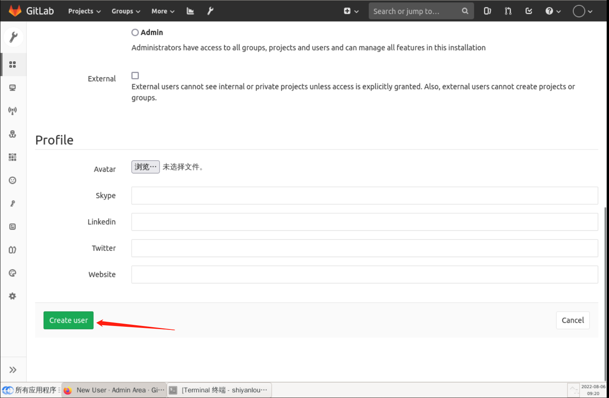

### Create a user

In a production environment, to prevent security problems caused by high privileges of a single account, it is rare to use super-managed accounts directly, but basically some sub-accounts are created.

For example, here we create a dev account to use. Click Admin Area and select `New user`, as follows:

Fill in the account information as required, as follows:

Then pull down to the latest, click `Create User`, that is to complete the user creation, as follows:

