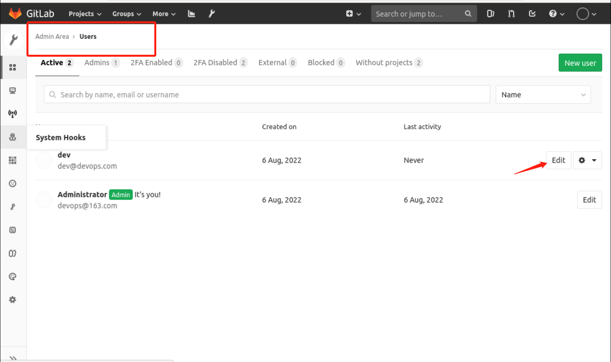

### Change password

If you configure the mailbox to send information, you will be sent an email to configure the password, however, since the mailbox information is not configured here, we change the password manually.

First enter the user management interface through `Admin Area - Users`, find the corresponding user and select `Edit` to modify it as follows:

Then enter the password you want to change, for example, here I entered `dev@123456`, as follows

> PS: By default, Gitlab requires a password strength greater than 8 bits.

Finally, pull down to the bottom and click `Save changes` to finish changing your password.
