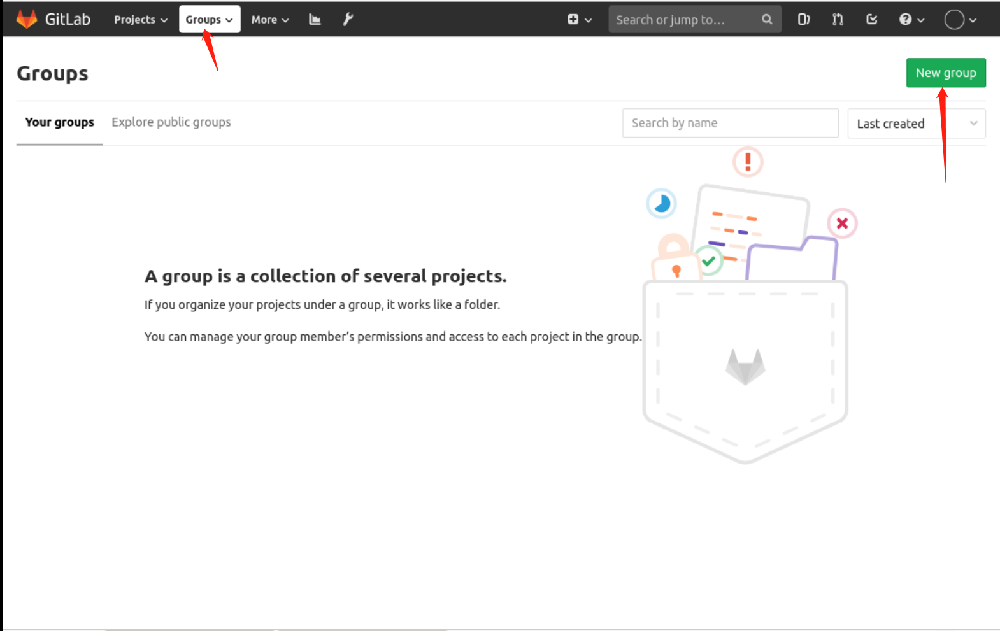
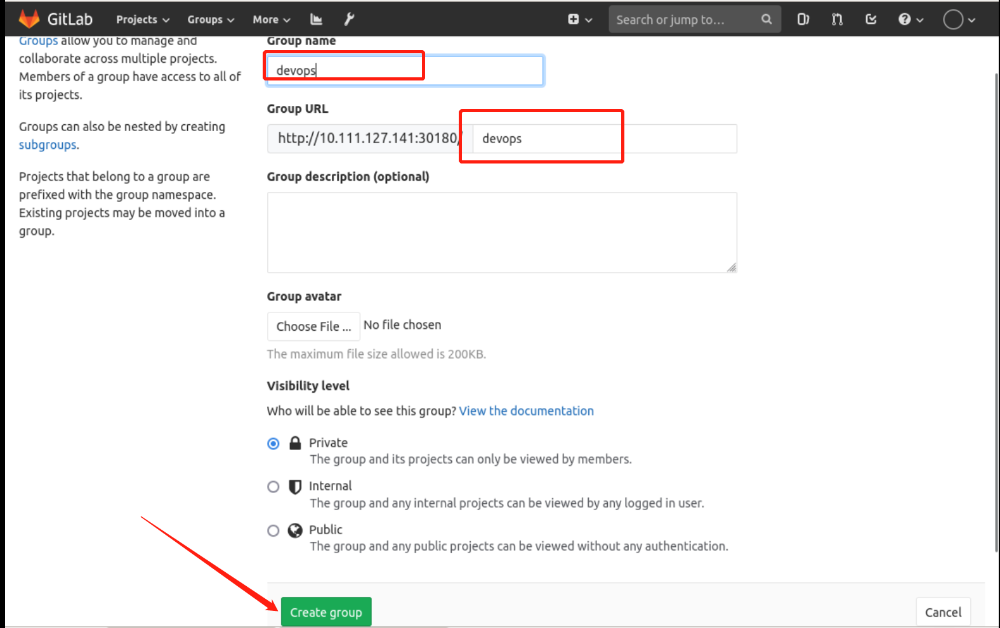
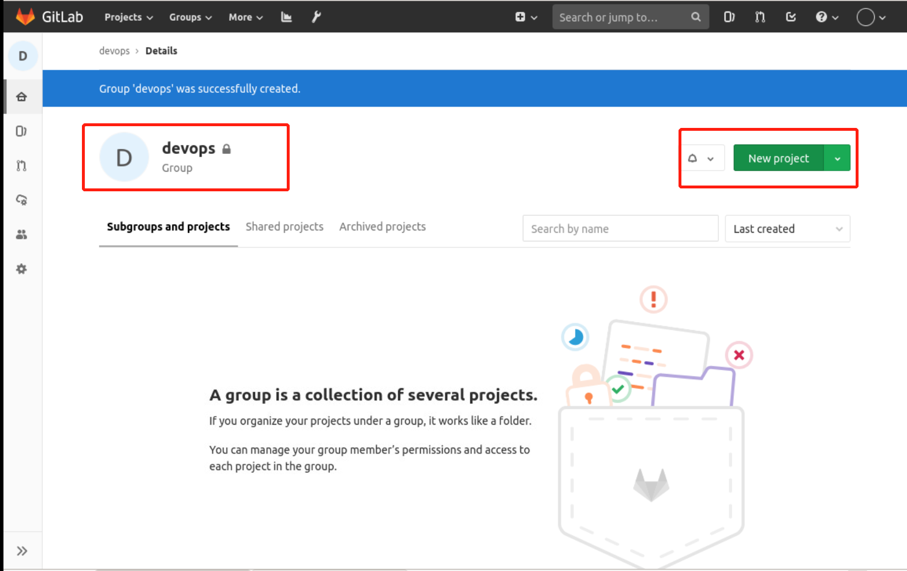

### Create a project

(1) To create a new project on Gitlab, select `Create a project` on the first page, as follows:

Then fill in the information as you see fit and click `Create project` to create the project, as follows:

This creation method will create the project directly under the current user by default, but at the production level, the company application will not be placed under the individual user, so we will create the Group first, as follows:

Fill in the group name `devops` and click Create, as follows

Then create the project in the group, the same steps as above.

