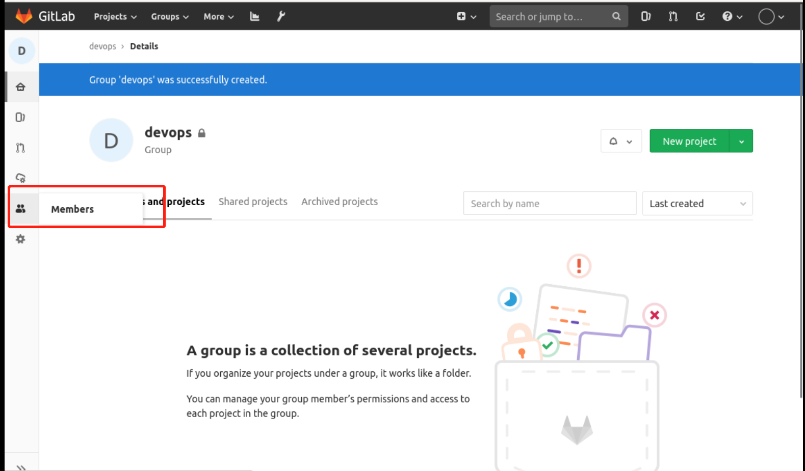
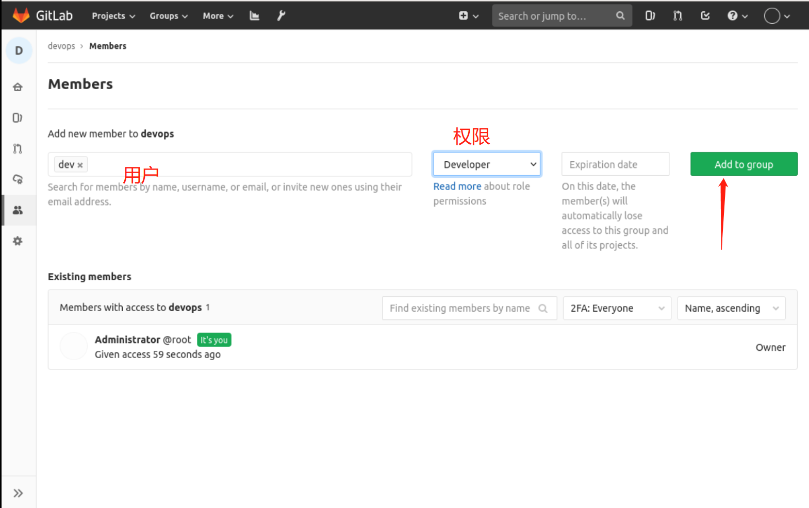
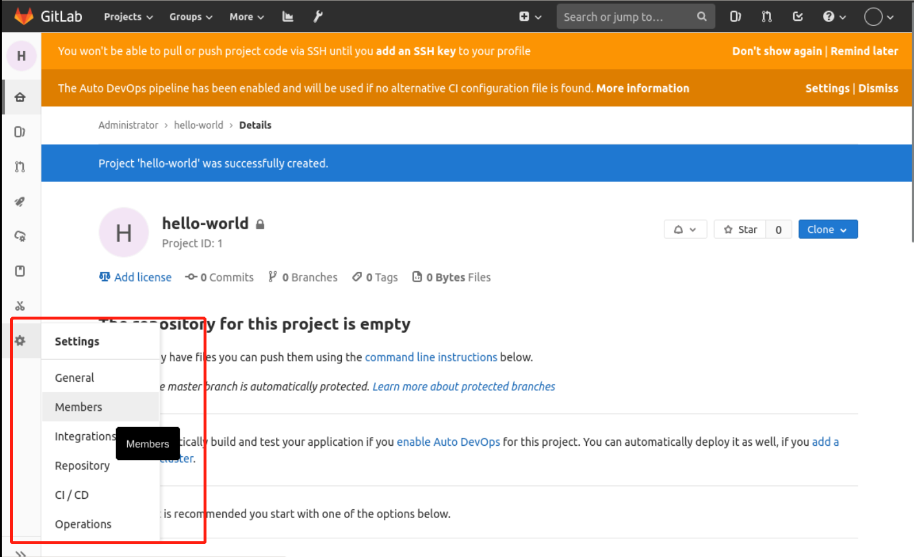
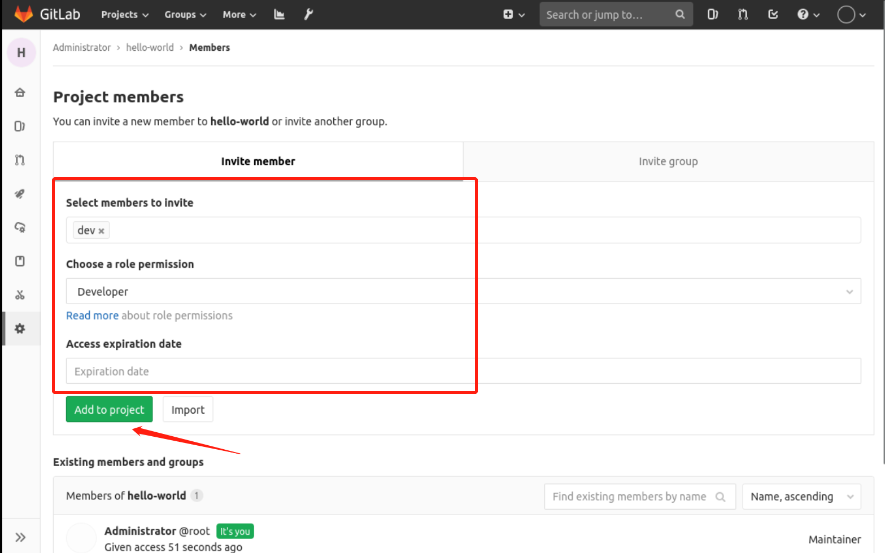

### User authorization

After a user has been created, only the project management rights under the current account are available. If you want to manage other projects or groups, you have to authorize them.

#### Authorize to group permissions

First, go to the group we created, `devops`, and select member on the left, as follows:

Then add users, configure permissions, and add to the group as follows

This gives the `dev` user `Developer` permissions for the `devops` group.

#### Authorization to a project

Sometimes you just want to grant users access to a project by going directly to the project, for example, here I go to the hello-word project and select member in the settings, as follows

Then select user, set permissions, and add to the project as follows

