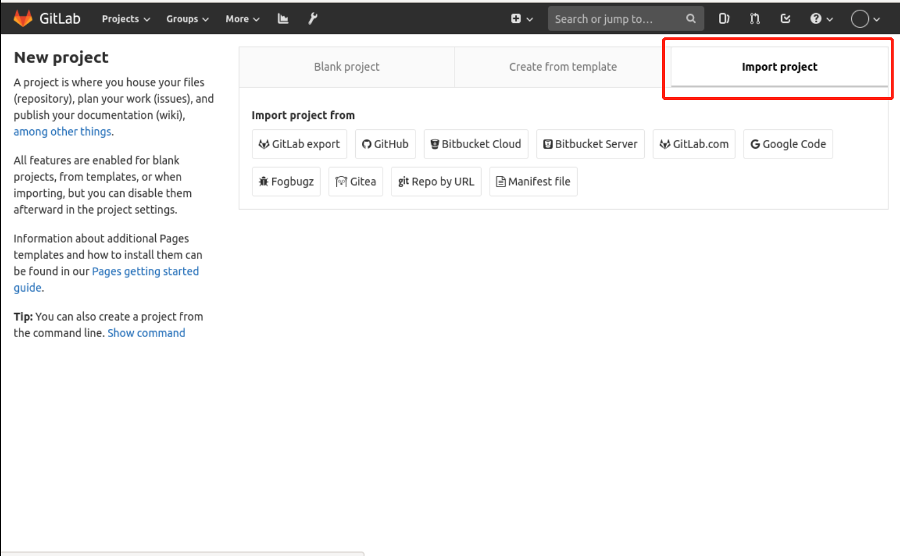
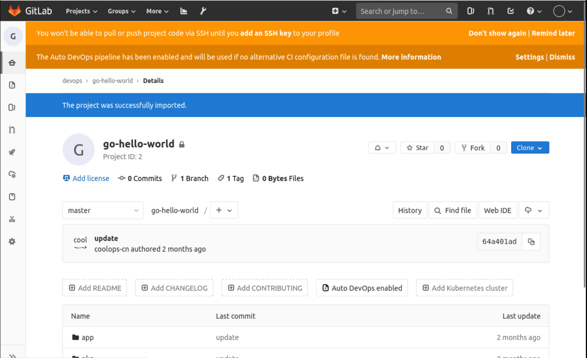

### Import the project

The above description is all about creating your own project, while in the whole experiment, for convenience, the code will be prepared first, so we can just import it directly.

For this purpose, I have prepared a Go project on which the subsequent pipeline is based, and the project address is: `https://gitee.com/coolops/go-hello-world.git`.

Let's import that project into Gitlab.

First, create the project in Gitlab, then select Import project:

Then select the source. I'm using the code from gitee here, so select `repo by url` and fill in the corresponding information, as follows:

Click the Import button and wait for a while to finish importing the project.

This is all you need to do to get started with Gitlab. You'll need to explore more features yourself, but the features we've covered so far will be enough to complete the rest of this course.
