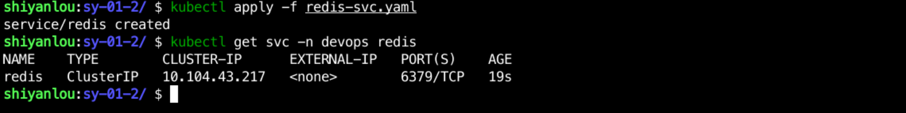
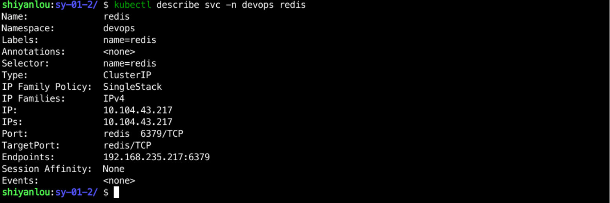

### Create Redis Service

Create a `redis-svc.yaml` file in the `/home/shiyanlou/Code/devops/sy-01-2` directory and write the following:

```yaml
apiVersion: v1
kind: Service
metadata.
  name: redis
  namespace: devops
  labels.
    name: redis
spec.
  ports.
    - name: redis
      port: 6379
      targetPort: redis
  selector.
    name: redis
```

Use `kubectl apply -f redis-svc.yaml` to create the Service, and then use `kubectl get svc -n devops redis` to see the creation:



> PS: Since the type of the Redis Service in this experiment is ClusterIP, it can only be accessed inside the cluster. If you need to access outside the cluster for special reasons, you can change the type to NodePort.

And you can use `kubectl describe svc -n devops redis` to see the Service's specific information.



At this point, the Redis deployment is complete.
