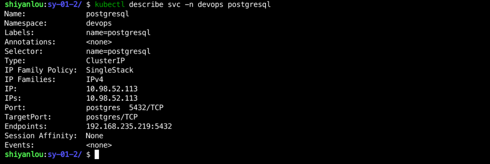

### Create PostgreSQL Service

Create a `postgresql-svc.yaml` file in the `/home/shiyanlou/Code/devops/sy-01-2` directory and write the following:

```yaml
apiVersion: v1
kind: Service
metadata.
  name: postgresql
  namespace: devops
  labels.
    name: postgresql
spec.
  ports.
    - name: postgres
      port: 5432
      targetPort: postgres
  selector.
    name: postgresql
```

Then use `kubectl apply -f postgresql-svc.yaml` to create the Service, and then use `kubectl get svc -n devops postgresql` to view the creation, as follows:


And you can use `kubectl describe svc -n devops postgresql` to see the details of the Service, as follows



At this point, the PostgreSQL deployment is complete.
