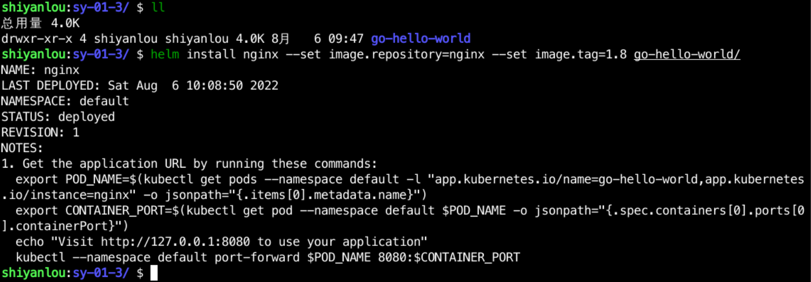

### Deploying the application

Deploying an application with Helm is very simple, just use `helm install`, and it can take different parameters, if you don't know how to use it, you can use `helm install -h` to see the help documentation.

Here we deploy the Nginx service, version 1.8, with the following command:

```bash
cd /home/shiyanlou/Code/devops/sy-01-3/
helm install nginx --set image.repository=nginx --set image.tag=1.8 go-hello-world/
```

After the command is executed, the output is as follows:



Use `kubectl get pod` to see if the `nignx` service is started properly, as follows:


Use `helm list` to see the deployed releases in the cluster, followed by the namespace if they are not under the `default` namespace, for example: `helm list -n kube-system`.


where `REVISION` is the current version.
