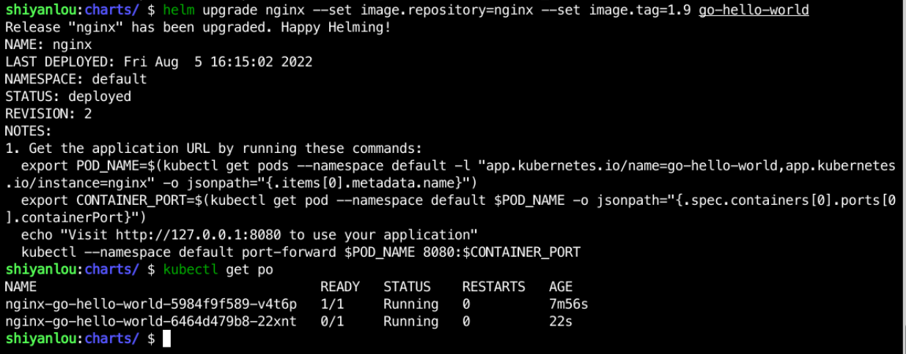

### Update the application

If the application has been iterated and you now want to update to a new version, for example, if we want to update to Nginx version 1.9, use the following command:

```bash
helm upgrade nginx --set image.repository=nginx --set image.tag=1.9 go-hello-world/
```

After executing the command, the output is as follows:



You can see that the version number `REVISION` has changed to 2. You can also use `helm list` to check it.
