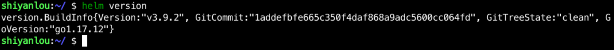

## Installing the Helm client

Helm client download address: `https://github.com/helm/helm/releases`

> Version 3.6.3 is pre-installed in the environment

Choose the version that suits you to download, for example, I download the latest `v3.9.2` version here with the following command:

```bash
wget https://get.helm.sh/helm-v3.9.2-linux-amd64.tar.gz
```

Of course, sometimes the download is not possible due to the internet speed, so I am providing a version of the download address here, as follows:

```bash
wget https://gitee.com/coolops/go-hello-world/attach_files/1148296/download/helm-v3.9.2-linux-amd64.tar.gz
```

After downloading, you will have a `` helm-v3.9.2-linux-amd64.tar.gz` file locally, unpack it and put the executable file under  ``/usr/local/bin`` with the following command:

```bash
tar xf helm-v3.9.2-linux-amd64.tar.gz
cd linux-amd64
sudo mv helm /usr/local/bin
```

Then use `helm version` to see if you can get the Helm version properly, as follows:


