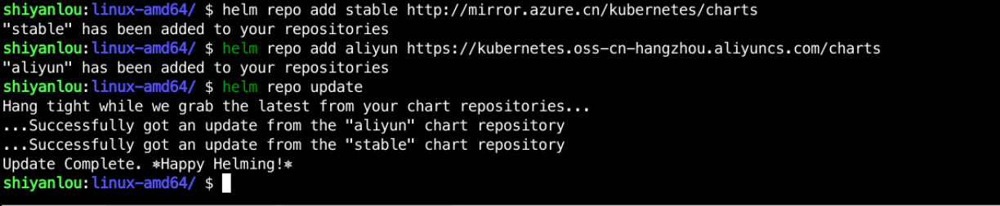

### Add repository

Add a repository with the `helm repo add` command, as follows:

```bash
helm repo add stable http://mirror.azure.cn/kubernetes/charts
helm repo add aliyun https://kubernetes.oss-cn-hangzhou.aliyuncs.com/charts
```

After adding, you can use `helm repo update` to update the repository as follows:


