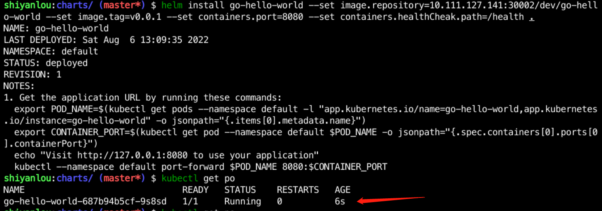
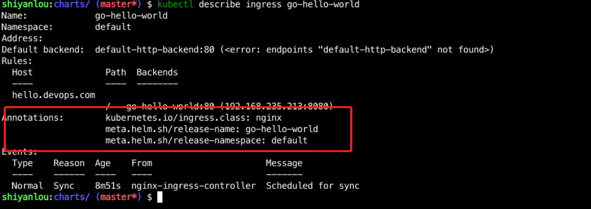

### Deploying applications in Kubernetes

We already made Charts for `go-hello-world` in the previous section and uploaded them to Gitlab, so now we'll deploy the application based on this Chart.

Now that we've pulled the code into `/home/shiyanlou/Code/go-hello-world`, you can use `git clone` to pull the code if you haven't already done so.

Now we go into the `deploy/charts` directory and deploy the application using `helm install`, the detailed command is as follows:

```bash
cd deploy/charts
helm install go-hello-world --set image.repository=10.111.127.141:30002/dev/go-hello-world --set image.tag=v0.0.1 --set containers.port= 8080 --set containers.healthCheak.path=/health .
```

Then use `kubectl get pod` to check the application status as follows:



Now the application has been successfully deployed to Kubernetes, but we don't have access to its configuration Ingress yet. First use `helm upgrade` to update it, with the following command:

```bash
helm upgrade go-hello-world --set image.repository=10.111.127.141:30002/dev/go-hello-world --set image.tag=v0.0.1 --set containers.port= 8080 --set containers.healthCheak.path=/health --set ingress.enabled=true --set ingress.hosts[0].host=hello.devops.com --set ingress.hosts [0].paths[0].path=/ --set ingress.hosts[0].paths[0].pathType=ImplementationSpecific .
```

Then use `kubectl get ingress` to view the Ingress information as follows:


Use `sudo vim /etc/hosts` to open the hosts file and add the parsing at the end as follows

```bash
10.111.127.141 hello.devops.com
```

Accessed in a browser, it shows the following:


If you use a domain name to access the 404, check whether the Ingress configuration is configured, use `kubectl describe ingress go-hello-world` to see the detailed configuration, and check whether the annotations field has `kubernetes.io/ingress.class: nginx `, if not, just add it.


