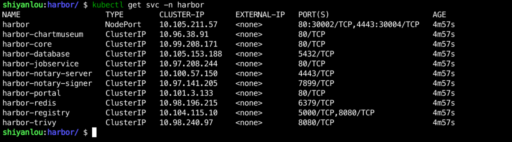

### Deploying Harbor

Here we use helm to deploy Harbor.

#### Add the official Harbor Helm Chart repository

```bash
helm repo add harbor https://helm.goharbor.io
helm repo update
```

#### Download the Harbor Charts package locally

Go to the `/home/shiyanlou/Code/devops` directory, create a `sy-01-4` directory, and download Harbor's Chart: ``

```bash
mkdir /home/shiyanlou/Code/devops/sy-01-4
cd /home/shiyanlou/Code/devops/sy-01-4
helm search repo harbor
helm pull harbor/harbor --untar
```

After the command is executed, the Charts for Harbor will be downloaded locally and extracted as follows


#### Create namespace

Create a `harbor` namespace and deploy all Harbor-related applications to it.

```bash
kubectl create namespace harbor
```

#### custom configuration

Create the `my-values.yaml` file in the `/home/shiyanlou/Code/devops/sy-01-4/harbor` directory and enter the following:

```yaml
expose.
  type: nodePort
  tls.
    enabled: false
externalURL: http://10.111.127.141:30002
persistence.
  persistentVolumeClaim.
    registry.
      storageClass: "openebs-hostpath"
    chartmuseum.
      storageClass: "openebs-hostpath"
    jobservice.
      storageClass: "openebs-hostpath"
    database.
      storageClass: "openebs-hostpath"
    redis.
      storageClass: "openebs-hostpath"
    trivy.
      storageClass: "openebs-hostpath"
```

> PS: externalURL: `http://10.111.127.141:30002` is the address for Harbor UI login, you can change it according to your own configuration when you do the experiment.

#### Installing Harbor

Use the following command to install Harbor:

```bash
cd /home/shiyanlou/Code/devops/sy-01-4/harbor
helm install harbor -n harbor -f my-values.yaml .
```

After successful execution of the command, you can use `kubectl get pod -n harbor` to check the deployment status, only when all applications are `running`, it means the deployment is successful, as follows:


Use `kubectl get service -n harbor` to see the service information of the Harbor component, as follows:


