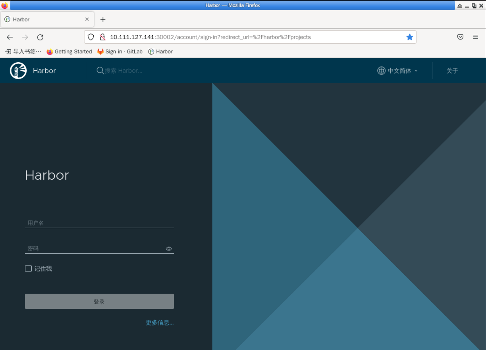

### Login

Log in to Harbor using the `externalURL` address we configured in `my-values.yaml`, as follows:

Enter the username/password: `admin/Harbor12345` to log in, and you will be taken to the following screen:

