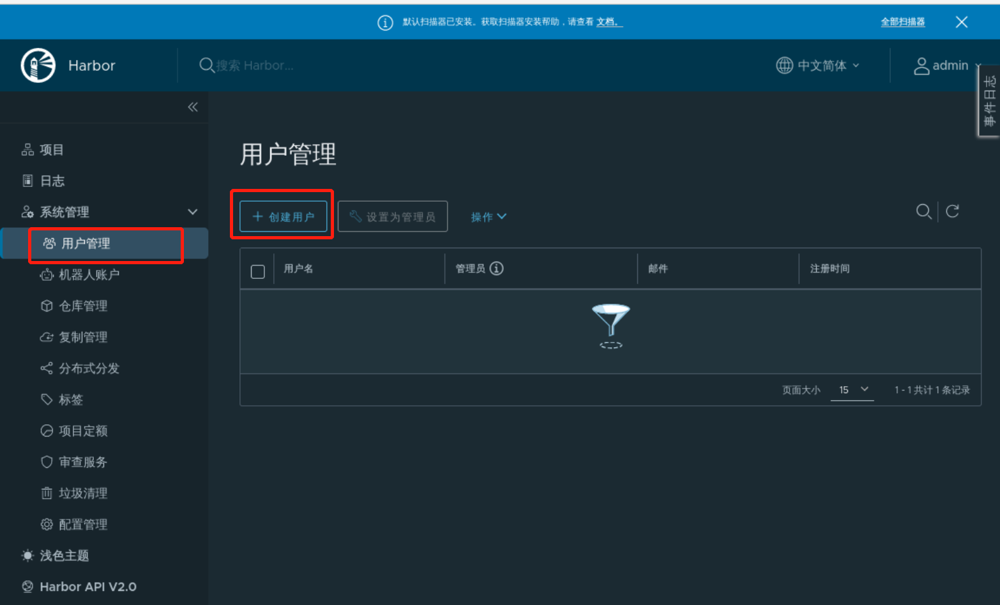
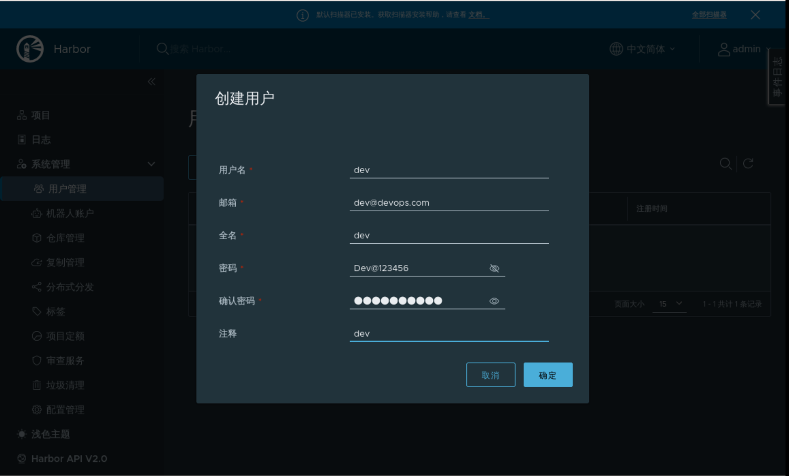

### Create user

Create a dev user for pushing and downloading images.

Click **User Management** -> **Create User**, as follows:

Enter the necessary information as required, as follows:

You can manage users according to the situation.
