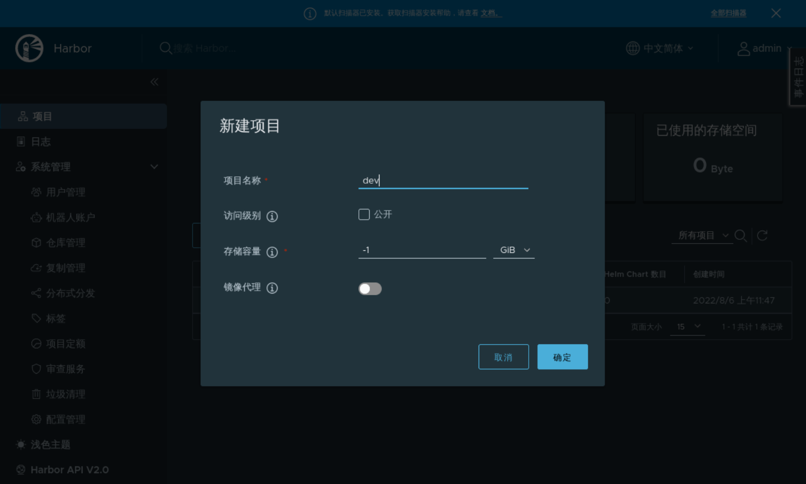

### Project management

When we deploy Harbor, there will be a `library` project by default, which is public, meaning that all images under this project can be uploaded and downloaded.

But in production, for security, we will create some private projects that need to be authenticated to access, which can be divided by project group, by application, or by environment, depending on your needs.

Click **Project** -> **New Target**, as follows:

Enter the necessary information as required, as follows:

After clicking OK, the private project is created.
