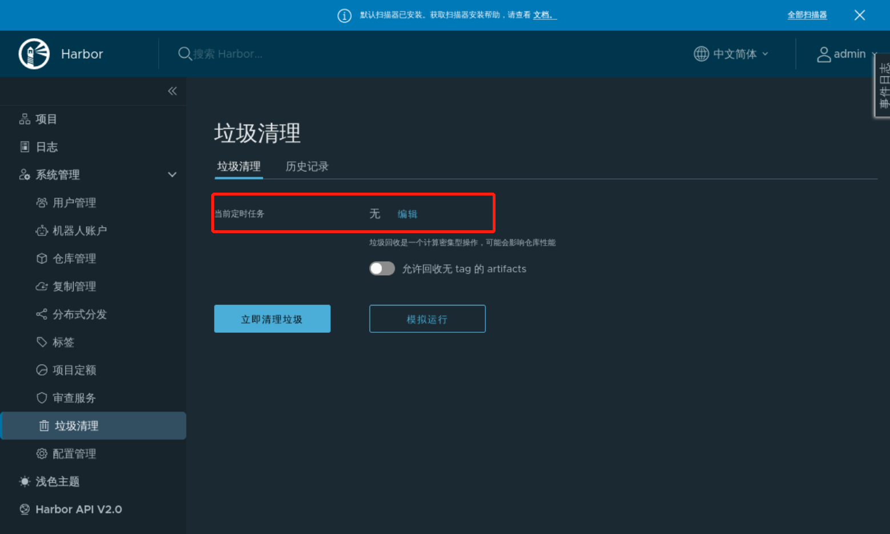
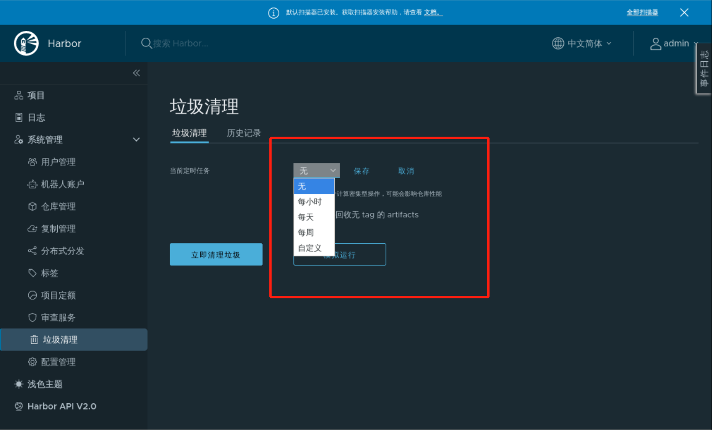

### Garbage cleanup

Mirror repositories often contain useless mirrors that take up disk space and cause a certain amount of wasted resources. Fortunately, Harbor provides a place for us to clean them up.

Click **Cleanup** to enter the cleanup interface, which is divided into **Manual Cleanup** and **Automatic Cleanup**.

#### Manual Cleanup

Click the **Clean Junk Now** button directly to complete the manual cleanup, as follows:

#### Auto Cleanup

Automatic cleanup is polled by configuring timed tasks and clicking the **Edit** button:

You can directly choose to clean up by trivia, day, or week, or you can customize the time as follows:

The custom configuration is to configure `cron`, whose configuration rule is **seconds minutes hours days months weeks**, which has more **seconds** parameters than Cron on Linux, as follows

